# PQC Website IDE

> **Status: active development (pre-1.0).** APIs, wire formats, and UI may change. Feedback and contributions are welcome.

**Open-source low-code website builder** that encrypts and authenticates every design sync with **NIST post-quantum cryptography**, while keeping today’s classical security practices (AES-GCM, TLS, JWT zero-trust).

Build pages visually. On **Save**, the site AST is protected with a **hybrid KEM** and an **ML-DSA digital signature** so data transfer is harder to harvest-now / decrypt-later when large quantum computers arrive—and still meets current cybersecurity expectations.

| Layer | Algorithms |
|-------|------------|
| Key encapsulation (hybrid) | **ML-KEM-768** (FIPS 203) + **X25519** (classical ECDH) → HKDF → AES key |
| Bulk encryption | **AES-256-GCM** |
| Digital signatures | **ML-DSA-65** (FIPS 204) on sync + publish intents |
| Transport / session | TLS (e.g. Traefik), JWT + nonce/replay guards |

Classical-only RSA/ECC sync envelopes are **rejected** when `ENFORCE_PQC_ONLY=true`.

---

## Why this exists

Most website builders store or sync design state with classical crypto (or none). **Harvest Now, Decrypt Later (HNDL)** attackers can archive ciphertext today and break RSA/ECC later with quantum algorithms (e.g. Shor).

PQC Website IDE aims to be a practical, open toolkit for:

1. **Generating** simple websites (templates, presets, WYSIWYG canvas, SEO-ready export).
2. **Protecting** editor ↔ server data with **KEM + signatures** under new NIST PQC standards.
3. **Staying compatible** with current practice: AES-GCM content encryption, hybrid classical+PQC KEM, signed intents, zero-trust API checks.

---

## UI (from automated Selenium demo)

Light-first IDE shell — templates, canvas, inspector, hybrid PQC status:

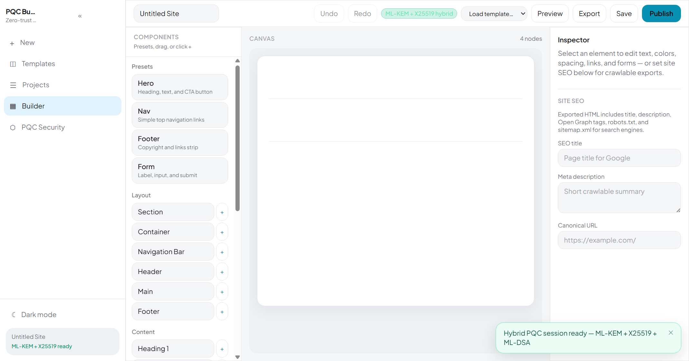

Blog template on the page-paper canvas:

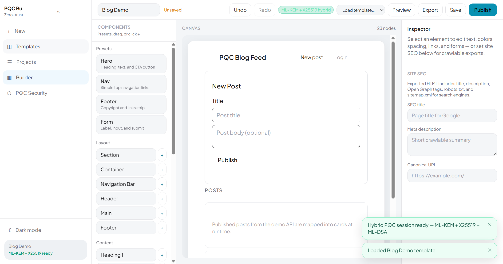

PQC Security panel (ML-KEM + X25519 hybrid · ML-DSA):

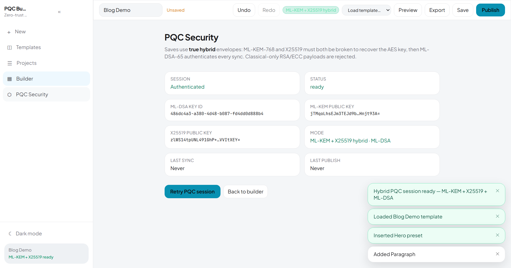

Live wire proof overlay after Save (algorithms asserted on the sync envelope):

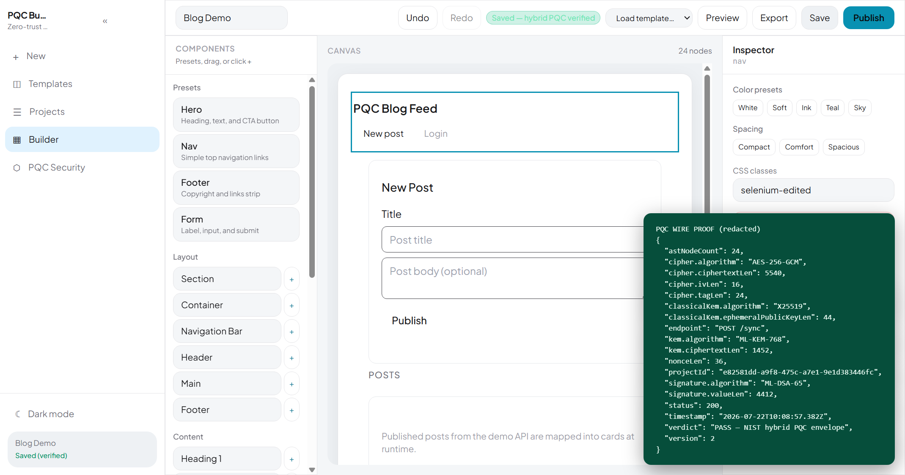

Publish → Preview:

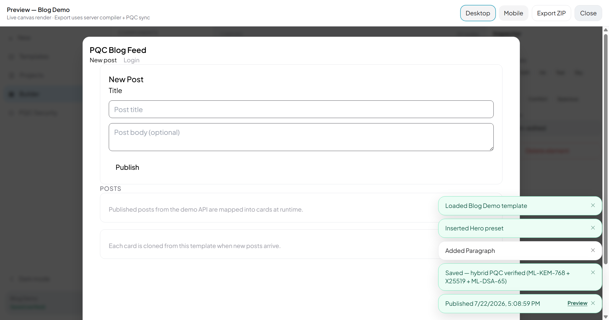

After Export ZIP:

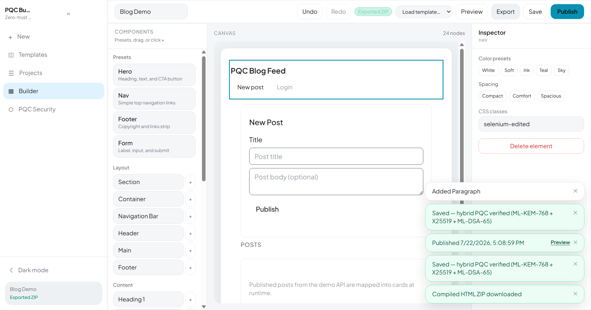

More step screenshots: [`apps/e2e/scripts/demo-shots/selenium/`](apps/e2e/scripts/demo-shots/selenium/)  
Machine-readable evidence: [`pqc-evidence.json`](apps/e2e/scripts/demo-shots/selenium/pqc-evidence.json)

---

## Features (current)

- Visual builder: Templates, section presets (Hero / Nav / Footer / Form), style chips, undo/redo
- **Multi-page sites** — page switcher, multi-HTML export + full `sitemap.xml`
- Templates: Login, Blog, **Landing (2 pages)**, Portfolio, Docs
- Light default theme + Dark toggle (`localStorage`)
- Hybrid PQC save path: Worker → API gateway → Go crypto-service
- **Auth:** Argon2 register/login, gated `dev-register`, OIDC hooks (501 until configured)
- **Postgres dual-write** when `DATABASE_URL` is set (users, keys, versions, audit)
- PQC Security panel with **recent audit events**
- Publish with ML-DSA-signed intent; Preview modal
- Export ZIP: HTML + CSS + SEO meta / Open Graph + `robots.txt` + `sitemap.xml`
- E2E browsers: Chromium + Firefox + WebKit (+ Edge on Windows)
- Security tests for HNDL (accept hybrid PQC; reject classical-only / forgery)

---

## Port map

| Port | Service |
|------|---------|
| **4000** | API gateway (`/api/*`, `/demo-api/*`) |
| **4001** | React IDE (Vite or Docker nginx; proxies `/api`) |
| **4010** | Compiled static demo (tests) |
| **4081** | Go crypto microservice |
| 5432 | PostgreSQL (Docker) |

> On some Windows Docker hosts, `:4000` may not bind. Use **http://127.0.0.1:4001** — nginx proxies `/api`. For security tests: `API_URL=http://127.0.0.1:4001`.

---

## Quick start

### Local

```bash
pnpm install
pnpm --filter @pqc/shared build

# Terminal 1
cd apps/crypto-service && go mod tidy && go run .

# Terminal 2
cd apps/api-gateway && pnpm dev

# Terminal 3
cd apps/web && pnpm dev
```

Open **http://localhost:4001**.

### Docker

```bash
cp infra/.env.example infra/.env
docker compose -f infra/docker-compose.yml up -d --build
```

IDE: **http://127.0.0.1:4001/**

---

## Demo walkthrough

1. Open the IDE — wait for badge **ML-KEM + X25519 hybrid**.
2. **Templates** → **Blog** (or top-bar Load template).
3. Edit content / SEO in the Inspector; optional Hero preset.
4. **Save** — hybrid encrypt + ML-DSA sign; badge → *Saved — hybrid PQC verified*.
5. **Publish** — signed intent; Preview opens.
6. **Export** — download ZIP (crawlable HTML + sitemap/robots).

### Headed Selenium (screenshots + wire proof)

```bash
python apps/e2e/scripts/selenium_demo.py
```

### Security / HNDL tests

```bash
API_URL=http://127.0.0.1:4001 pnpm security-tests
```

```bash
pnpm test:unit:coverage
pnpm test:e2e
```

---

## Architecture (short)

| Component | Tech |
|-----------|------|
| Frontend | React 19, Vite, Tailwind, Zustand, @dnd-kit |
| Browser crypto | Web Worker, `@noble/post-quantum`, `@noble/curves` (X25519) |
| API | Fastify (auth, sync, compile, export) |
| Crypto service | Go + Cloudflare CIRCL + X25519/HKDF |
| Desktop (optional) | Tauri 2 |

Docs: [docs/architecture.md](docs/architecture.md) · [docs/crypto-api.md](docs/crypto-api.md) · [docs/testing.md](docs/testing.md) · [docs/sovereign-deploy.md](docs/sovereign-deploy.md)

---

## Project structure

```
apps/web              # React IDE (:4001)
apps/api-gateway      # Fastify API (:4000)
apps/crypto-service   # Go PQC microservice (:4081)
apps/security-tests   # HNDL / forgery / XSS audits
apps/e2e              # Playwright + Selenium demos
apps/desktop          # Tauri wrapper
packages/shared       # AST + hybrid crypto payload schemas
docs/                 # Architecture + demo images
infra/                # Docker Compose + Traefik
archive/              # Legacy PQC cyber-attack simulator (education)
```

---

## Auth modes

| Mode | When | Behavior |
|------|------|----------|
| `VITE_AUTH_MODE=dev` (default local) | `ALLOW_DEV_REGISTER` not false | Silent `dev-register` bootstrap |
| `VITE_AUTH_MODE=login` (Docker default) | Production-ish | Login / register UI (Argon2) |
| OIDC hooks | `OIDC_*` + `VITE_OIDC_ENABLED=true` | `/api/auth/oidc/login` redirect; callback stub until IdP wiring |

## Roadmap progress (core gaps)

### Phase 1 — Persistence, auth, audit — **done**
Argon2 register/login, gated `dev-register`, OIDC stubs, Postgres dual-write, audit API + panel.

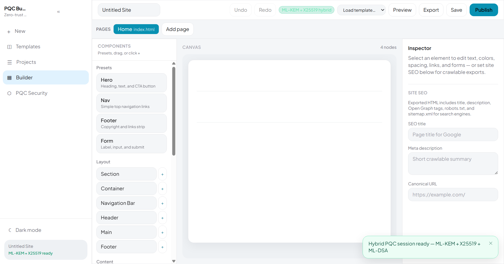
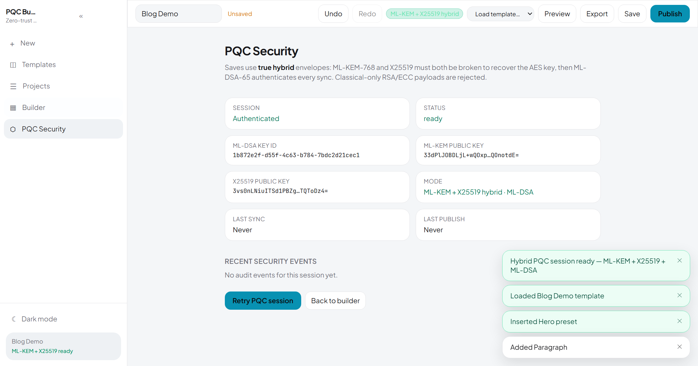
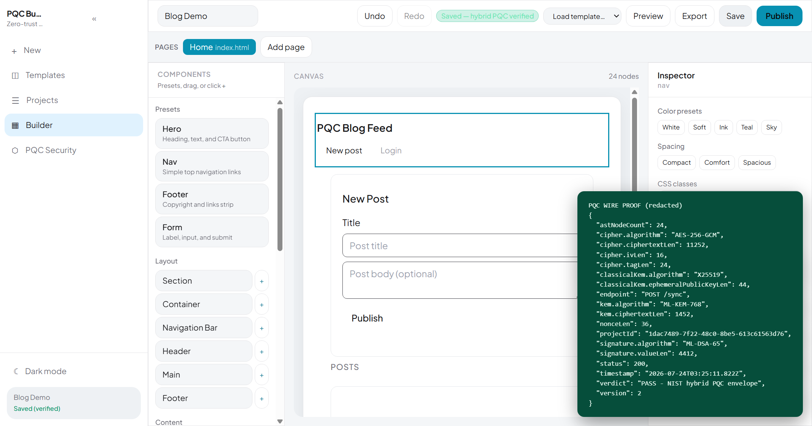

### Phase 2 — Multi-page + templates — **done**
AstRoot v2 pages, Landing/Portfolio/Docs templates, page switcher, multi-file ZIP + sitemap.

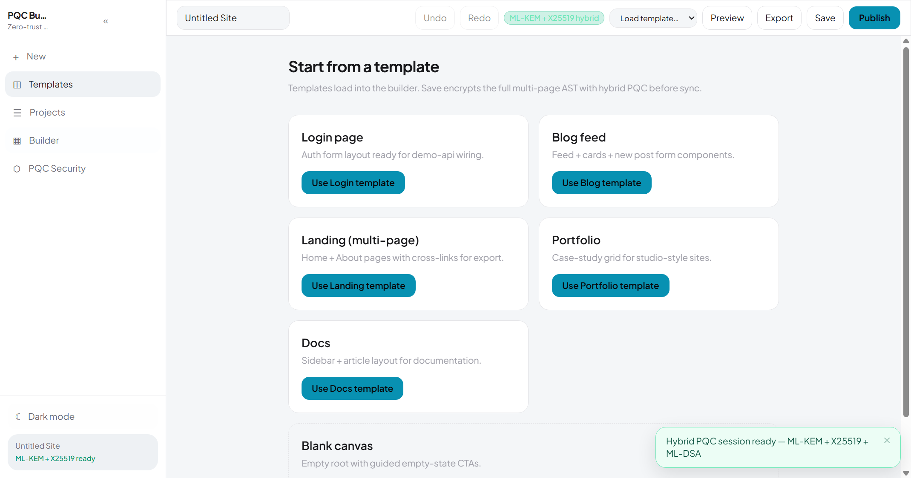
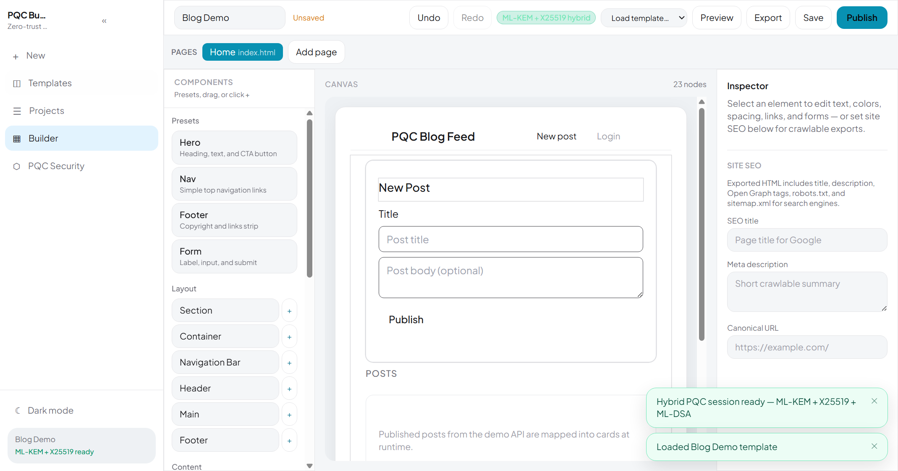
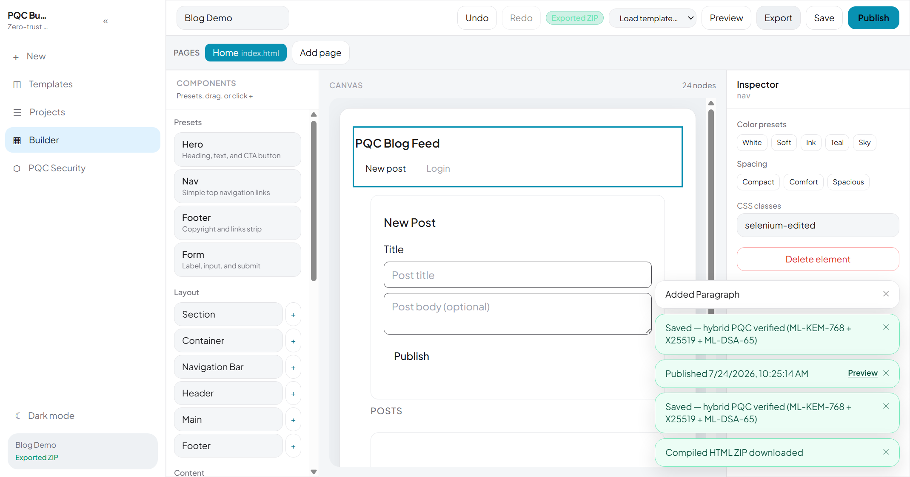

### Phase 3 — Multi-browser QA — **done**
Playwright projects: Chromium, Firefox, WebKit; Edge on Windows; CI matrix for `ide-save-flow`.


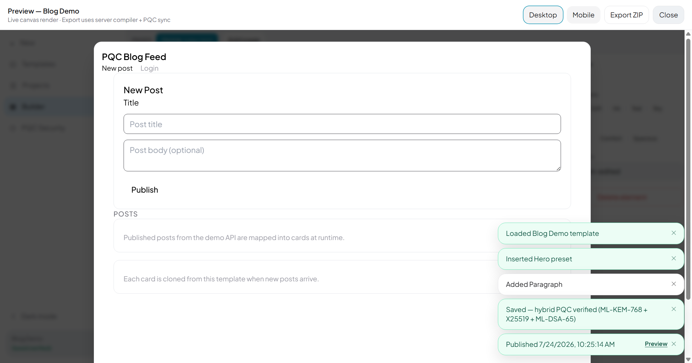

### Current state (verified)

| Suite | Result |
|-------|--------|
| `@pqc/shared` unit | 47 passed |
| `@pqc/api-gateway` unit | 73 passed |
| `@pqc/web` unit | 88 passed |
| Security / HNDL (live API) | 18 passed |
| Headed Selenium UI + wire proof | PASS (`apps/e2e/scripts/demo-shots/selenium/pqc-evidence.json`) |

**Solid today:** hybrid sync (ML-KEM-768 + X25519 + AES-GCM + ML-DSA-65), multi-page AST/export, Argon2 auth + gated `dev-register`, audit list UI, Chromium/Firefox/WebKit CI projects, Selenium functional proof.

### Gaps to fix later

| Gap | Why it matters | Suggested next step |
|-----|----------------|---------------------|
| Postgres is dual-write only (memory is still hot path) | Restart loses sessions unless PG hydrate is finished | Boot-time hydrate from PG; make PG primary when `DATABASE_URL` set |
| Token revocation / nonces in-memory | Multi-instance deploy can miss revokes | Persist revoked JWTs + nonces in Postgres (or Redis) |
| OIDC is stub (501 / redirect only) | No real IdP login yet | Complete code exchange + `oidc_subject` user upsert |
| Password users not rate-limited / locked out | Brute-force on `/login` | Add rate limit + lockout on auth routes |
| Schema vs runtime drift residual | Keys/audit richer in memory than some ops | Keep Drizzle schema + migrate SQL as single source |
| GitOps export incomplete | ZIP works; remote push not productized | Finish signed Git push + credential UX |
| Virtual canvas DnD at 1000+ nodes | Large trees may drop poorly | Wire dnd-kit over virtualized rows |
| Full OIDC UI + login-mode E2E | Selenium/dev path uses `VITE_AUTH_MODE=dev` | Add Playwright login-mode project |
| Edge CI on Linux | No `msedge` channel on Ubuntu runners | Keep Edge Windows-local; document matrix |

### Recommended next steps (priority)

1. **Postgres-primary store** — hydrate on boot; drop silent memory-only production mode.
2. **Finish OIDC** — real callback + tests; disable password/`dev-register` via flags in prod.
3. **Auth hardening** — rate limits, lockout, Argon2 params audit, secure cookie/refresh option.
4. **Login-mode E2E + Selenium** — cover AuthGate register/login in CI.
5. **GitOps** — end-to-end push of compiled multi-page sites to a protected remote.

## Contributing

Issues and PRs are welcome. Please do **not** commit secrets (`.env`, JWT keys, crypto service secrets).

## License

MIT — see [LICENSE](LICENSE).

## Related archive

The original PQC cyber-attack education simulator lives under:

**[archive/pqc-cybersec-simulator/](archive/pqc-cybersec-simulator/)**
