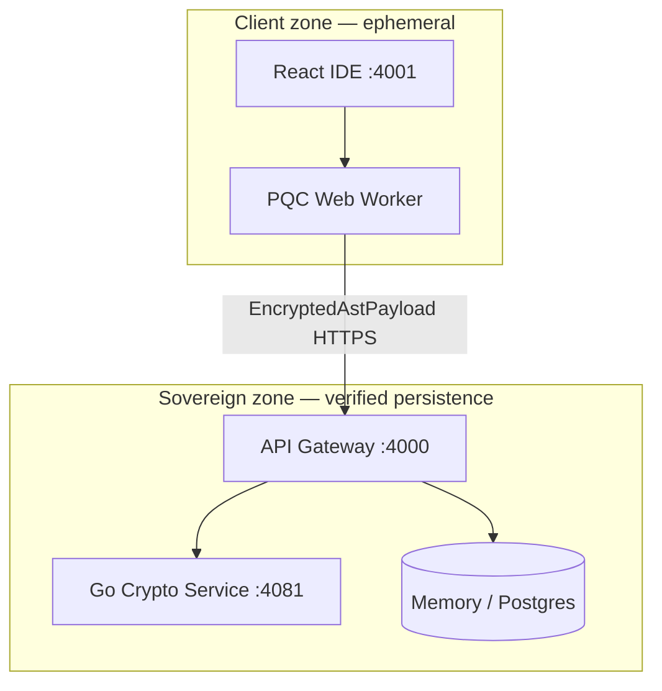
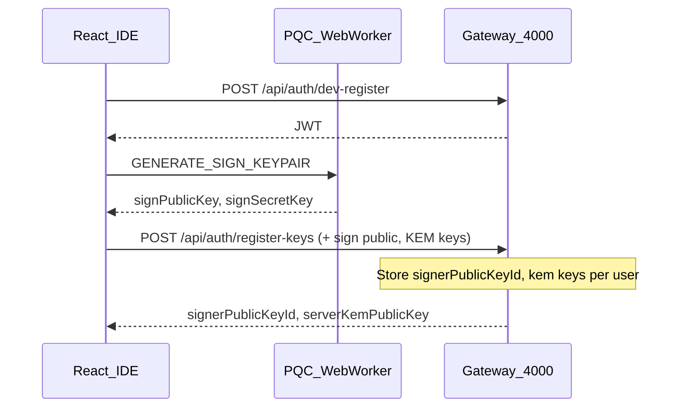
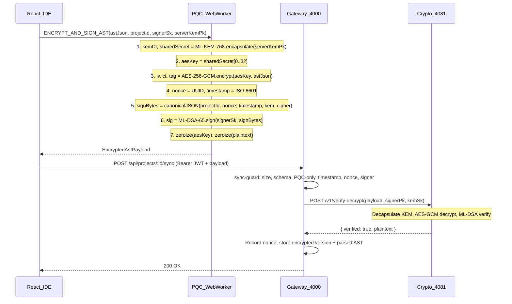
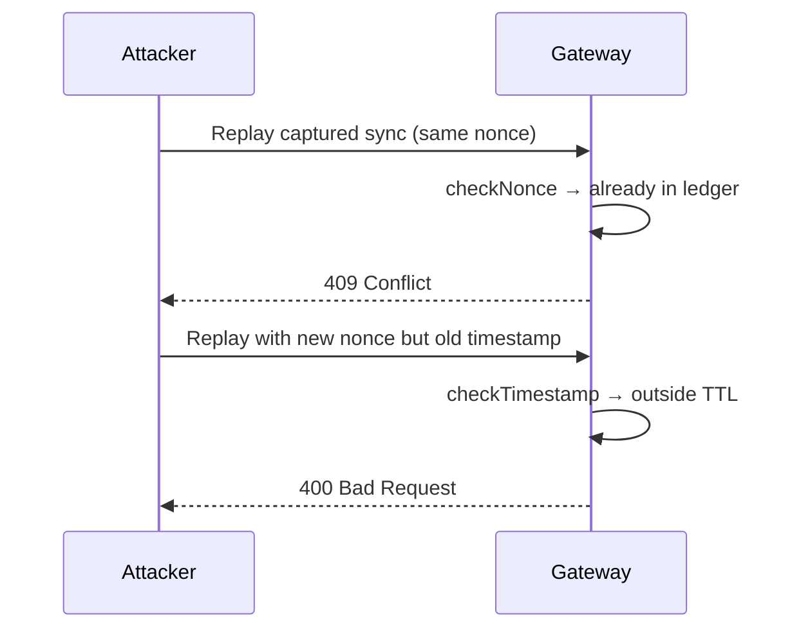
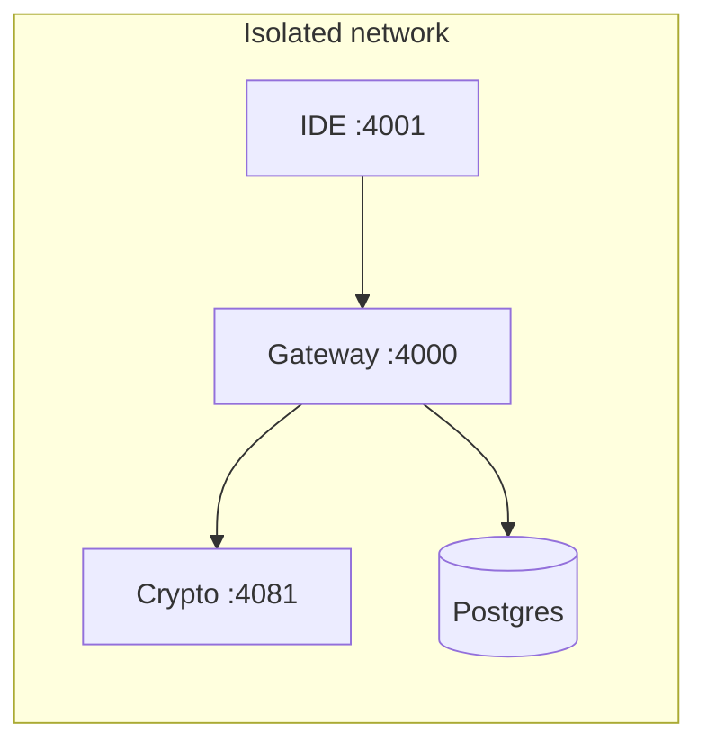

# PQC Website IDE — System Architecture

Zero-trust low-code website builder where every design save is an **encrypted, signed Abstract Syntax Tree (AST)**. Cryptography is hybrid post-quantum: **ML-KEM-768** (FIPS 203) protects the bulk key, **AES-256-GCM** encrypts the AST, and **ML-DSA-65** (FIPS 204) authenticates every state-changing sync.

---

## 1. Design goals

| Goal | How it is met |
|------|----------------|
| **Data sovereignty** | Plaintext AST exists only in the browser worker (ephemeral) and in verified memory on the server during decrypt; persistence stores ciphertext + metadata. |
| **Air-gapped operation** | Stack runs offline: Vite IDE, Fastify gateway, Go crypto-service, optional Postgres — no third-party SaaS. `ENFORCE_PQC_ONLY=true` blocks classical algorithms. |
| **Zero-trust** | JWT alone does not authorize sync; ML-DSA signature + nonce + timestamp required before any write. |
| **Harvest Now, Decrypt Later (HNDL) defense** | Production mode rejects RSA/ECC KEM or signatures; only ML-KEM-768 + ML-DSA-65 accepted. |

---

## 2. Logical architecture



| Layer | Algorithm (NIST) | Role |
|-------|------------------|------|
| **KEM** | ML-KEM-768 (FIPS 203) | Encapsulate a fresh AES-256 key to the server’s registered KEM public key |
| **Bulk cipher** | AES-256-GCM | Encrypt the JSON AST (confidentiality + integrity of payload body) |
| **Signature** | ML-DSA-65 (FIPS 204) | Authenticate `{ projectId, nonce, timestamp, kem, cipher }` — binds ciphertext to intent and time |

Implementation today uses **`@noble/post-quantum`** inside a Web Worker (pure JavaScript). The same message contract supports a future **OQS-WASM** module without changing the wire format.

---

## 3. Trust boundaries

### 3.1 Ephemeral (client — never persisted as plaintext)

| Asset | Location | Lifecycle |
|-------|----------|-----------|
| Live AST JSON | Zustand + React | Cleared on navigation / tab close |
| ML-DSA **secret** signing key | Worker memory | Generated at registration; held for session |
| AES-256 content key | Worker only | Derived from ML-KEM shared secret; **zeroed** after encrypt |
| ML-KEM encapsulation randomness | Worker | Per-save |

The worker explicitly zeroizes sensitive buffers (`zeroize()` in [`apps/web/src/workers/pqc.worker.ts`](../apps/web/src/workers/pqc.worker.ts)).

### 3.2 Persistent (sovereign — only after verify)

| Asset | Storage | Written when |
|-------|---------|--------------|
| Encrypted AST blob (KEM + AES ciphertext) | `project_versions` / memory-store | After ML-DSA verify + decrypt |
| User ML-DSA **public** key + server KEM keypair refs | `signing_keys` | Key registration |
| Nonce ledger `(userId, nonce)` | In-memory set (→ Postgres) | After successful sync |
| Security audit events | `audit_logs` | PQC violation, sig failure, unknown signer |

**Rule:** The gateway never writes decrypted AST to durable storage until `verify-decrypt` returns `verified: true`.

### 3.3 Internal-only

| Service | Port | Exposure |
|---------|------|----------|
| Go crypto-service | **4081** | Docker internal network only |
| Postgres | **5432** | Internal |

---

## 4. Service topology (4000 port range)

| Service | Port | Responsibility |
|---------|------|----------------|
| **api-gateway** | 4000 | `/api/*` (auth, sync, compile, export) and `/demo-api/*` (Login/Blog demo) |
| **web** (Vite) | 4001 | React IDE; proxies `/api` and `/demo-api` to :4000 |
| **crypto-service** | 4081 | ML-KEM decapsulation + ML-DSA verification |
| **compiled static** | 4010 | Exported Login/Blog HTML (dev/E2E) |
| **postgres** | 5432 | Production persistence (Docker) |

Constants: [`packages/shared/src/ports.ts`](../packages/shared/src/ports.ts).

---

## 5. Cryptographic handshake — browser to backend

### 5.1 Session bootstrap (key registration)

Before the first encrypted sync, the client registers PQC keys with the gateway. The server generates (or the client generates) ML-KEM and ML-DSA key material; **only public keys and server-side KEM secrets** are stored server-side.



The JWT is used only for **transport authentication** (who is calling). It does **not** replace ML-DSA on sync bodies.

### 5.2 Per-save encrypt-and-sign (main handshake)

This is the core PQC handshake for each **Save** action. All heavy work runs in the worker so the UI thread stays responsive (same role as a WASM module).



**Failure paths:** Signature failure → **403**, JWT revoked, `SIGNATURE_VERIFICATION_FAILED` audit. Classical algorithms when `ENFORCE_PQC_ONLY` → **403**, `CLASSICAL_ALGORITHM_REJECTED`. Reused nonce → **409**.

Gateway may verify via **Go** (`CRYPTO_USE_GO=true`) or **noble** in-process ([`crypto-local.ts`](../apps/api-gateway/src/services/crypto-local.ts)) for air-gapped single-node deploys.

---

## 6. Replay attack prevention

State-mutating syncs must be **fresh** and **unique**. Defense is layered in [`apps/api-gateway/src/lib/sync-guard.ts`](../apps/api-gateway/src/lib/sync-guard.ts):

| Control | Mechanism | HTTP on failure |
|---------|-----------|-----------------|
| **Cryptographic nonce** | Random UUID per save; ledger key `userId:nonce` | **409** Nonce already used |
| **Timestamp window** | `timestamp` must be within `NONCE_TTL_MS` (default 5 min) of server clock | **400** Timestamp expired or invalid |
| **ML-DSA signature** | Binds nonce + timestamp + ciphertext; attacker cannot alter fields without invalidating sig | **403** + token revoke |
| **Project binding** | `projectId` in URL must match payload | **400** Project ID mismatch |
| **JWT revocation** | On signature or PQC policy failure, session token invalidated | Subsequent calls **401** |



Nonces are committed to the ledger **only after** successful verify-decrypt, so a failed attempt does not block legitimate retries with a new nonce.

---

## 7. Encrypted AST payload (wire format)

Canonical schema: [`packages/shared/src/crypto-payload.ts`](../packages/shared/src/crypto-payload.ts) (Zod: `encryptedAstPayloadSchema`).

### 7.1 JSON structure

```json
{
  "version": 1,
  "projectId": "550e8400-e29b-41d4-a716-446655440000",
  "nonce": "f47ac10b-58cc-4372-a567-0e02b2c3d479",
  "timestamp": "2026-05-26T12:00:00.000Z",
  "kem": {
    "algorithm": "ML-KEM-768",
    "ciphertext": "<base64 ML-KEM ciphertext>"
  },
  "cipher": {
    "algorithm": "AES-256-GCM",
    "iv": "<base64, 12 bytes>",
    "ciphertext": "<base64 AES ciphertext>",
    "tag": "<base64, 16-byte GCM tag>"
  },
  "plaintextMeta": {
    "astNodeCount": 42,
    "schemaVersion": 1
  },
  "signature": {
    "algorithm": "ML-DSA-65",
    "value": "<base64 ML-DSA signature>"
  },
  "signerPublicKeyId": "550e8400-e29b-41d4-a716-446655440002"
}
```

### 7.2 Field reference

| Field | Type | Description |
|-------|------|-------------|
| `version` | `1` | Payload format version |
| `projectId` | UUID | Must match `POST /api/projects/:id/sync` path parameter |
| `nonce` | string (≥16 chars) | Unique per sync; typically UUID v4 |
| `timestamp` | ISO-8601 datetime | Client clock; validated against server TTL |
| `kem.algorithm` | `ML-KEM-768` \| `RSA-2048` \| `ECC-P256` | KEM algorithm id (classical rejected if PQC-only) |
| `kem.ciphertext` | base64 | ML-KEM encapsulation to server’s KEM public key |
| `cipher.algorithm` | `AES-256-GCM` | Bulk encryption algorithm |
| `cipher.iv` | base64 | 96-bit GCM nonce |
| `cipher.ciphertext` | base64 | Encrypted UTF-8 JSON AST |
| `cipher.tag` | base64 | 128-bit GCM authentication tag |
| `plaintextMeta.astNodeCount` | int | Node count hint for quotas/metrics (not signed separately) |
| `plaintextMeta.schemaVersion` | `1` | AST schema version |
| `signature.algorithm` | `ML-DSA-65` \| `RSA-2048` | Signature algorithm id |
| `signature.value` | base64 | ML-DSA signature over canonical sign bytes |
| `signerPublicKeyId` | UUID | References registered public key for this user |

### 7.3 Signed bytes (ML-DSA input)

Only these fields are signed (canonical JSON with **sorted keys**):

```json
{
  "cipher": { "algorithm": "AES-256-GCM", "iv": "...", "ciphertext": "...", "tag": "..." },
  "kem": { "algorithm": "ML-KEM-768", "ciphertext": "..." },
  "nonce": "f47ac10b-58cc-4372-a567-0e02b2c3d479",
  "projectId": "550e8400-e29b-41d4-a716-446655440000",
  "timestamp": "2026-05-26T12:00:00.000Z"
}
```

Implementation: [`canonicalSignBytes()`](../packages/shared/src/crypto-payload.ts) — UTF-8 encode `JSON.stringify(orderedObject)`.

`plaintextMeta` and `signature` are **not** in the signed blob; changing them without breaking the signature is impossible for `kem`/`cipher`/`nonce`/`timestamp`/`projectId`.

### 7.4 Plaintext inside `cipher.ciphertext`

After decrypt, plaintext is JSON:

```json
{
  "version": 1,
  "root": {
    "id": "uuid",
    "type": "div",
    "props": {},
    "children": []
  }
}
```

AST node types and palette are defined in [`packages/shared/src/ast.ts`](../packages/shared/src/ast.ts).

---

## 8. Air-gapped deployment



1. Build images on a connected staging host; `docker save` / `docker load` into the enclave.
2. Set `ENFORCE_PQC_ONLY=true`, strong `JWT_SECRET`, `CRYPTO_SERVICE_SECRET`.
3. No outbound internet required at runtime; PQC runs in worker (noble) and optionally Go.
4. Optional: `CRYPTO_USE_GO=false` to verify entirely with noble in the gateway if Go is undesirable.

See [`deploy-web.md`](deploy-web.md) and [`threat-model.md`](threat-model.md).

---

## 9. Related documentation

| Document | Contents |
|----------|----------|
| [`threat-model.md`](threat-model.md) | Threats, HNDL, CI security tests |
| [`master-roadmap.md`](master-roadmap.md) | Full 17-prompt product roadmap |
| [`design-system.md`](design-system.md) | IDE UI architecture |
| [`testing.md`](testing.md) | Vitest, Playwright, security regression |

---

## 10. Code map

| Concern | Path |
|---------|------|
| Payload schema | [`packages/shared/src/crypto-payload.ts`](../packages/shared/src/crypto-payload.ts) |
| Browser encrypt/sign | [`apps/web/src/workers/pqc.worker.ts`](../apps/web/src/workers/pqc.worker.ts) |
| Main-thread client | [`apps/web/src/crypto/pqcClient.ts`](../apps/web/src/crypto/pqcClient.ts) |
| Replay / validation guards | [`apps/api-gateway/src/lib/sync-guard.ts`](../apps/api-gateway/src/lib/sync-guard.ts) |
| Sync route | [`apps/api-gateway/src/routes/projects.ts`](../apps/api-gateway/src/routes/projects.ts) |
| Verify / decrypt | [`apps/crypto-service/main.go`](../apps/crypto-service/main.go) |
