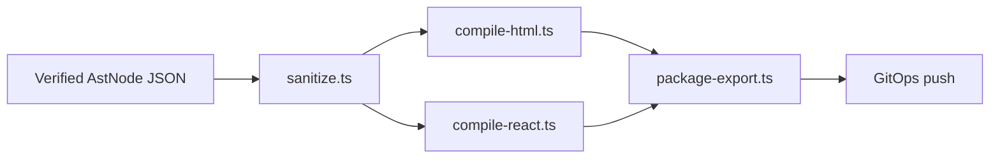

# AST-to-Code Compiler

The gateway compiles **decrypted, ML-DSA-verified** AST JSON into production-ready **HTML**, **scoped CSS**, and **React (TSX)**. User-controlled props are sanitized aggressively to block XSS in generated sites.

---

## Pipeline



| Module | Path | Role |
|--------|------|------|
| Entry | [`ast-to-code.ts`](../apps/api-gateway/src/compiler/ast-to-code.ts) | `compileAstToSite()` |
| Sanitization | [`sanitize.ts`](../apps/api-gateway/src/compiler/sanitize.ts) | Allowlists, pattern blocklist, escapes |
| HTML | [`compile-html.ts`](../apps/api-gateway/src/compiler/compile-html.ts) | Semantic HTML + scoped CSS |
| React | [`compile-react.ts`](../apps/api-gateway/src/compiler/compile-react.ts) | TSX `Page` component |
| Packaging | [`package-export.ts`](../apps/api-gateway/src/compiler/package-export.ts) | ZIP stream + Git push |
| Routes | [`export.ts`](../apps/api-gateway/src/routes/export.ts) | HTTP export APIs |

---

## Security (XSS)

**Blocked patterns** (text, attributes, CSS values):

- `<script`, `javascript:`, `on*=`, `expression(`, `@import`, `data:text/html`

**Allowlists:**

- HTML tags: semantic layout + forms + media (`section`, `nav`, `h1`, `input`, …)
- Attributes: `class`, `href`, `src`, `alt`, `type`, `name`, `placeholder`, `data-demo`, …
- CSS properties: `color`, `padding`, `margin`, `display`, `flex`, … (no `behavior`, `binding`)

**Escaping:**

- HTML text/attributes → entity escape (`sanitizeText`)
- JSX literals → backslash escape (`sanitizeJsxText`)
- URLs → `https://`, `/`, or `#` only

Violations throw `CompilerSecurityError` → HTTP **400** `Unsafe AST content`.

---

## API

### ZIP download

```
GET /api/projects/:id/export?demoMode=true
Authorization: Bearer <jwt>
```

Returns `application/zip` with:

| File | Content |
|------|---------|
| `index.html` | Full document |
| `styles.css` | Scoped rules from `customCss` props |
| `Page.tsx` | React page |
| `demo-app.js` | Optional demo runtime |
| `README.md` | Export metadata |

### GitOps push

```
POST /api/projects/:id/export/git?demoMode=true
Authorization: Bearer <jwt>
Content-Type: application/json

{
  "remoteUrl": "https://github.com/org/repo.git",
  "branch": "main",
  "commitMessage": "feat: export site from PQC IDE",
  "token": "<optional HTTPS PAT>"
}
```

Requires `GIT_OPS_ENABLED=true` and `git` CLI on the host. Credentials are passed per-request or via `GIT_OPS_TOKEN` — never logged or stored in the repo.

---

## Usage (code)

```typescript
import { compileAstToSite } from "./compiler/ast-to-code.js";
import { createZipExportStream } from "./compiler/package-export.js";

const site = compileAstToSite(astRoot, "My Site", { demoMode: true });
const { stream, filename } = createZipExportStream(site, "My Site");
```

---

## Tests

`pnpm --filter @pqc/api-gateway test` — `ast-to-code.test.ts` (XSS, output shape, Git URL validation).
