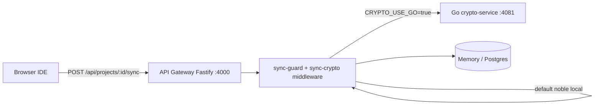

# Secure API and PQC KEM Decapsulation Service

Stateless **Fastify API gateway** (port **4000**) fronts a dedicated **Go crypto microservice** (port **4081**) for ML-KEM decapsulation, AES-256-GCM decryption, and ML-DSA verification. Both layers enforce payload size caps and rate limits to mitigate cryptographic denial-of-service.

---

## Architecture



| Component | Path | Responsibility |
|-----------|------|----------------|
| **Sync controller** | [`apps/api-gateway/src/routes/projects.ts`](../apps/api-gateway/src/routes/projects.ts) | Route handler after validation |
| **Validation middleware** | [`apps/api-gateway/src/middleware/sync-crypto.ts`](../apps/api-gateway/src/middleware/sync-crypto.ts) | Envelope + crypto verify |
| **Replay / schema guards** | [`apps/api-gateway/src/lib/sync-guard.ts`](../apps/api-gateway/src/lib/sync-guard.ts) | Zod, PQC-only, nonce, timestamp |
| **Field size limits** | [`apps/api-gateway/src/lib/crypto-limits.ts`](../apps/api-gateway/src/lib/crypto-limits.ts) | Pre-decode bounds |
| **Crypto client** | [`apps/api-gateway/src/services/crypto-client.ts`](../apps/api-gateway/src/services/crypto-client.ts) | Go RPC or local fallback |
| **Local decapsulate** | [`apps/api-gateway/src/services/crypto-local.ts`](../apps/api-gateway/src/services/crypto-local.ts) | Noble ML-KEM + AES-GCM in-process |
| **Go service** | [`apps/crypto-service/main.go`](../apps/crypto-service/main.go) | CIRCL ML-KEM-768 decapsulate (horizontally scalable) |

---

## Request flow: `POST /api/projects/:id/sync`

1. **JWT** — `authenticate` middleware (`Bearer` token).
2. **Global rate limit** — `@fastify/rate-limit` on all routes (`RATE_LIMIT_MAX`, default 100/min).
3. **Sync rate limit** — stricter per-route cap (`SYNC_RATE_LIMIT_MAX`, default 30/min).
4. **`validateSyncEnvelope`** — size, Zod schema, crypto field bounds, PQC-only, timestamp TTL, nonce uniqueness, signer key lookup.
5. **`verifySyncCryptography`** — ML-DSA verify → ML-KEM decapsulate → AES-256-GCM decrypt (ephemeral keys zeroed).
6. **Persist** — nonce committed only after successful verify; encrypted payload + parsed AST stored.

---

## Cryptographic middleware (deliverable)

### `validateSyncEnvelope`

Runs **before** any KEM work:

- `checkPayloadSize` — raw JSON ≤ `MAX_PAYLOAD_BYTES` (default 2 MiB).
- `parseEncryptedPayload` — Zod `encryptedAstPayloadSchema`.
- `checkCryptoFieldSizes` — base64 length bounds (reject multi-MB bogus KEM blobs).
- `checkPqcOnly` — reject RSA/ECC when `ENFORCE_PQC_ONLY=true`.
- `checkTimestamp` / `checkNonce` / `checkSignerKey`.

Attaches `request.syncContext` for the controller.

### `verifySyncCryptography`

Delegates to `verifyAndDecrypt()`:

- **`CRYPTO_USE_GO=true`** — `POST http://crypto-service:4081/v1/verify-decrypt` with `X-Internal-Secret`.
- **Default** — `verifyAndDecryptLocal()` using `@noble/post-quantum`.

On **any** failure → HTTP **403** `{ "message": "Forbidden" }` only. No stack traces, no “bad signature” vs “bad KEM” distinction (reduces timing/oracle leakage).

---

## Go microservice: ephemeral decapsulation

`POST /v1/verify-decrypt` body:

```json
{
  "payload": { "...EncryptedAstPayload..." },
  "signerPublicKeyB64": "...",
  "kemSecretKeyB64": "..."
}
```

Processing (all in request-scoped memory):

1. Verify ML-DSA-65 over canonical sign bytes.
2. `kemScheme.Decapsulate(sk, kemCiphertext)` → shared secret.
3. Copy first 32 bytes → AES key; `zeroize(sharedSecret)` and `zeroize(aesKey)` after use.
4. AES-256-GCM decrypt AST JSON.

Limits: `http.MaxBytesReader` (2 MiB), read timeouts, internal secret via `subtle.ConstantTimeCompare`.

---

## DoS protections

| Control | Default | Env var |
|---------|---------|---------|
| Max HTTP body | 2 MiB | `MAX_PAYLOAD_BYTES` |
| Global rate limit | 100 / min | `RATE_LIMIT_MAX`, `RATE_LIMIT_WINDOW_MS` |
| Sync rate limit | 30 / min | `SYNC_RATE_LIMIT_MAX`, `SYNC_RATE_LIMIT_WINDOW_MS` |
| Max KEM ciphertext (decoded) | 1200 B | (constant in `crypto-limits.ts`) |
| Crypto RPC timeout | 15 s | (in `crypto-client.ts`) |

---

## Error handling policy

| Condition | Status | Client body |
|-----------|--------|-------------|
| Oversized body | 413 | `Payload too large` |
| Schema / field bounds | 400 | `Invalid encrypted payload` |
| Replay (nonce) | 409 | `Nonce already used` |
| Classical algorithms | 403 | `Forbidden` (+ audit, token revoke) |
| Any crypto failure | 403 | `Forbidden` (+ audit, token revoke) |
| Unhandled server fault | 500 | `Internal error` (no stack) |

---

## Configuration

```bash
# Gateway
PORT=4000
ENFORCE_PQC_ONLY=true
MAX_PAYLOAD_BYTES=2097152
CRYPTO_SERVICE_URL=http://localhost:4081
CRYPTO_SERVICE_SECRET=internal-crypto-shared-secret
CRYPTO_USE_GO=true          # use Go for decapsulation
SYNC_RATE_LIMIT_MAX=30

# Go crypto-service
CRYPTO_PORT=4081
CRYPTO_SERVICE_SECRET=internal-crypto-shared-secret
```

---

## Tests

- [`sync-guard.test.ts`](../apps/api-gateway/src/lib/sync-guard.test.ts) — guards and field sizes.
- [`projects.sync.test.ts`](../apps/api-gateway/src/routes/projects.sync.test.ts) — sync route integration.
- [`apps/security-tests`](../apps/security-tests/) — live API PQC acceptance.

Run gateway unit tests: `pnpm --filter @pqc/api-gateway test`.
