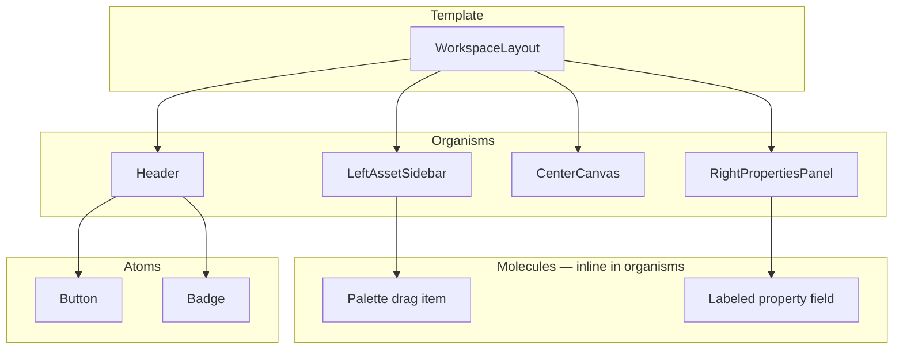
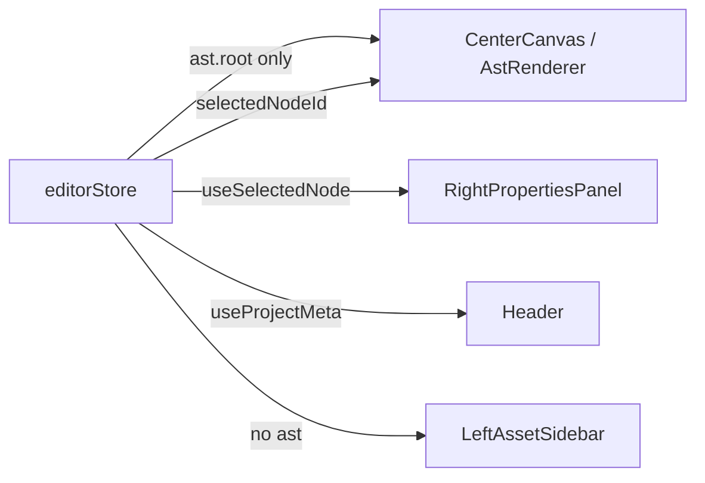

# IDE Design System & State Architecture

**Task:** Component-level design system and state management for the PQC low-code IDE.  
**Context:** Dark high-tech UI (Vercel/Wiz) + Shopify-style sidebar navigation; Atomic Design + Tailwind; Zustand for large immutable AST state; WCAG 2.1.  
**Deliverable:** Workspace layout boilerplate (Header, Left sidebar, Center canvas, Right properties) and global selection state — implemented under `apps/web/src/`.

---

## 1. Visual language

| Token | Value | Usage |
|-------|-------|--------|
| `surface` | `#09090b` | App background |
| `surface-raised` | `#18181b` | Panels (header, sidebars) |
| `surface-border` | `#27272a` | Dividers, inputs |
| `accent` | `#22d3ee` | Focus rings, selection, primary actions |
| Typography | Inter + JetBrains Mono | UI / node ids |

Defined in [`apps/web/tailwind.config.js`](../apps/web/tailwind.config.js) and [`apps/web/src/styles/tokens.css`](../apps/web/src/styles/tokens.css).

Global focus: 2px cyan outline (`:focus-visible`). `prefers-reduced-motion` disables long transitions.

---

## 2. Atomic Design hierarchy



| Layer | Path | Responsibility |
|-------|------|----------------|
| **Template** | [`app/WorkspaceLayout.tsx`](../apps/web/src/app/WorkspaceLayout.tsx) | Full-screen shell, auth bootstrap |
| **Organisms** | [`components/organisms/`](../apps/web/src/components/organisms/) | Header, sidebars, canvas shell |
| **Atoms** | [`components/atoms/`](../apps/web/src/components/atoms/) | `Button`, `Badge` |
| **Canvas** | [`canvas/`](../apps/web/src/canvas/) | AST rendering, DnD drop zones, virtualization |

---

## 3. Workspace layout (boilerplate)

Four-region layout: **header** + **three columns** (library | canvas | properties).

```
┌──────────────────────────────────────────────────────────────┐
│  Header — project name, PQC badge, Save, templates           │
├──────────┬─────────────────────────────────────┬─────────────┤
│  Left    │  Center Canvas (main)               │  Right      │
│  Asset   │  AST-driven preview + @dnd-kit      │  Properties │
│  Sidebar │                                     │  Panel      │
│  (256px) │  flex-1                             │  (288px)    │
└──────────┴─────────────────────────────────────┴─────────────┘
```

### 3.1 Template — `WorkspaceLayout`

```tsx
// apps/web/src/app/WorkspaceLayout.tsx (structure)
<div className="flex h-screen flex-col bg-surface">
  <a href="#main-content" className="sr-only focus:not-sr-only …">Skip to canvas</a>
  <Header />
  <div className="flex min-h-0 flex-1">
    <LeftAssetSidebar />
    <CenterCanvas />
    <RightPropertiesPanel />
  </div>
</div>
```

- `min-h-0` on the row prevents flex children from overflowing the viewport.
- Dev session + PQC key registration run once in `useEffect` (not in render path).

### 3.2 Header (`role="banner"`)

[`Header.tsx`](../apps/web/src/components/organisms/Header.tsx)

- Project name input (labeled + `sr-only` label)
- PQC status badge (`data-testid="pqc-status-badge"`)
- Template loader (`aria-label="Load demo template"`)
- Save (`aria-label="Save project with PQC encryption"`)

### 3.3 Left asset sidebar (`aria-label="Component library"`)

[`LeftAssetSidebar.tsx`](../apps/web/src/components/organisms/LeftAssetSidebar.tsx)

- Shopify-style grouped nav: categories from `PALETTE_COMPONENTS`
- Each palette entry is a **draggable button** with `aria-grabbed` and `aria-label="Drag {label} to canvas"`
- Uses `@dnd-kit/core` `useDraggable`

### 3.4 Center canvas (`role="main"`, `id="main-content"`)

[`CenterCanvas.tsx`](../apps/web/src/components/organisms/CenterCanvas.tsx) wraps:

- `DndContext` + `PointerSensor` (8px activation distance — reduces accidental drags)
- [`AstRenderer`](../apps/web/src/canvas/AstRenderer.tsx) or [`VirtualizedCanvas`](../apps/web/src/canvas/VirtualizedCanvas.tsx) when node count **> 1000**
- Canvas region: `data-testid="page-canvas"`, `aria-label="Page canvas"`

Drag-end → `insertNodeAt(parentId, index, type)` on the store (immutable AST clone).

### 3.5 Right properties panel (`aria-label="Properties panel"`)

[`RightPropertiesPanel.tsx`](../apps/web/src/components/organisms/RightPropertiesPanel.tsx)

- Empty state when nothing selected
- Bound inputs with `<label htmlFor="…">` for class, text, image URL
- Delete control with `aria-label="Delete selected element"`

---

## 4. State management (Zustand)

[`apps/web/src/stores/editorStore.ts`](../apps/web/src/stores/editorStore.ts)

### 4.1 Why Zustand

- **Single store** for AST + UI chrome (selection, crypto status, auth handles).
- **Fine-grained subscriptions** — components use selectors so the canvas does not re-render when only `cryptoStatus` changes in the header.
- **Immutable AST updates** — every mutation clones via `@pqc/shared` helpers (`cloneAst`, `insertChild`, `updateNodeProps`) before `set()`.

### 4.2 Core state shape

| Field | Type | Purpose |
|-------|------|---------|
| `ast` | `AstRoot` | Full design tree (version + root node) |
| `selectedNodeId` | `string \| null` | **Selected canvas element** (DOM/AST node id) |
| `projectId` / `projectName` | string | Sync target |
| `cryptoStatus` | enum | idle \| ready \| encrypting \| saved \| error |
| `authToken`, `signerPublicKeyId`, `kemPublicKeyB64` | string \| null | PQC session |

### 4.3 Selection API

```ts
// Write
selectNode(id: string | null)

// Read (avoids re-render when unrelated state changes)
const selected = useSelectedNode(); // useShallow + find in tree

// Canvas only subscribes to:
const root = useAstRoot();
const selectedId = useEditorStore((s) => s.selectedNodeId);
const selectNode = useEditorStore((s) => s.selectNode);
```

[`useSelectedNode()`](../apps/web/src/stores/editorStore.ts) uses `useShallow` so the properties panel updates only when the selected node reference changes.

### 4.4 AST mutations (DnD contract)

| Action | Store method | Used by |
|--------|--------------|---------|
| Insert from palette | `insertNodeAt(parentId, index, type)` | `CenterCanvas` drag-end |
| Update props | `updateSelectedProps(props)` | Properties panel |
| Delete | `removeSelected()` | Properties panel |
| Replace tree | `setAstRoot(root)` | Template loader |

### 4.5 Re-render boundaries



`LeftAssetSidebar` does not subscribe to `ast` — palette is static. This keeps drag operations from repainting the component list.

---

## 5. Canvas selection (AST node ↔ “selected DOM element”)

Selection is **AST node id**, not live DOM query:

1. User clicks a node in [`ComponentRegistry`](../apps/web/src/canvas/ComponentRegistry.tsx).
2. `onSelect(node.id)` → `selectNode(id)`.
3. Selected nodes get `ring-2 ring-accent` and `aria-selected={true}`.
4. Keyboard: **Enter** / **Space** on focused node (`role="group"`, `tabIndex={0}`).

The properties panel reads the same node via `useSelectedNode()` and writes back with `updateSelectedProps`.

---

## 6. WCAG 2.1 checklist

| Criterion | Implementation |
|-----------|----------------|
| **1.3.1 Info and relationships** | Landmarks: `banner`, `main`, `aside`, `nav`; headings in sidebars |
| **2.1.1 Keyboard** | Palette buttons focusable; canvas nodes keyboard-selectable |
| **2.4.1 Bypass blocks** | Skip link to `#main-content` |
| **2.4.6 Headings** | “Components”, “Properties”, category labels |
| **3.3.2 Labels** | All inputs have visible or `sr-only` labels |
| **4.1.2 Name, role, value** | `aria-grabbed`, `aria-selected`, `role="alert"` on errors |
| **2.3.3 Animation** | `prefers-reduced-motion` in `tokens.css` |

---

## 7. Atoms reference

### Button

[`Button.tsx`](../apps/web/src/components/atoms/Button.tsx) — `primary` | `ghost` → `.btn-primary` / `.btn-ghost` in CSS.

### Badge

[`Badge.tsx`](../apps/web/src/components/atoms/Badge.tsx) — PQC status tones: `success`, `warning`, `neutral`.

---

## 8. Running the IDE

```bash
cd apps/web && pnpm dev   # http://localhost:4001
```

Requires api-gateway on **http://localhost:4000** for auth and save.

---

## 9. Tests

| File | Covers |
|------|--------|
| [`WorkspaceLayout.test.tsx`](../apps/web/src/app/WorkspaceLayout.test.tsx) | Regions render |
| [`editorStore.test.ts`](../apps/web/src/stores/editorStore.test.ts) | insert / remove / update |
| [`AstRenderer.test.tsx`](../apps/web/src/canvas/AstRenderer.test.tsx) | Click selects node |

See [`testing.md`](testing.md) for full commands.
