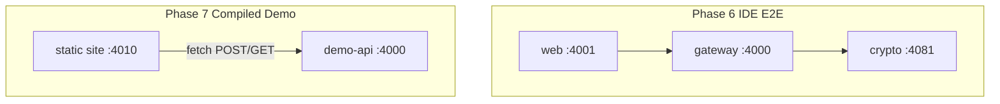

# PQC Website IDE — Full Roadmap (17 Prompts)

Single source of truth: [`docs/master-roadmap.md`](docs/master-roadmap.md) (to be generated from this plan). All ports below are **target** after migration.

| Service | Port | Role |
|---------|------|------|
| API gateway + demo-api (`/api/*`, `/demo-api/*`) | **4000** | Sovereign API + Login/Blog mock |
| React IDE (Vite) | **4001** | Low-code editor UI |
| Compiled Login/Blog (static) | **4010** | Exported site under test |
| Go crypto microservice | **4081** | ML-KEM decaps + ML-DSA verify (internal) |
| PostgreSQL | **5432** | Production persistence (Docker); runtime uses memory-store until wired |



---

## Phase 1: Architecture and UX Foundation

### 1.1 — System architecture (PQC, zero-trust)

**Task:** Design the high-level system architecture for a Zero-Trust, low-code Website Builder IDE utilizing Post-Quantum Cryptography (PQC).

**Context:**
- Data sovereignty and air-gapped capability are mandatory.
- Hybrid encryption: NIST FIPS 203 **ML-KEM-768** for key exchange securing **AES-256-GCM** payload; FIPS 204 **ML-DSA-65** for all digital signatures.
- Clear boundary between ephemeral client state and persistent sovereign storage.
- **Ports:** All local services in the **4000 range** (`4000` API+demo, `4001` IDE, `4010` compiled static, `4081` crypto).

**Deliverable:**
| Artifact | Path | Status |
|----------|------|--------|
| Architecture doc (sequence diagrams, payload JSON, replay rules) | [`docs/architecture.md`](architecture.md) | **Done** |
| Threat model | [`docs/threat-model.md`](threat-model.md) | **Done** |
| Encrypted AST schema | [`packages/shared/src/crypto-payload.ts`](../packages/shared/src/crypto-payload.ts) | **Done** |
| Sync route + replay guards | [`projects.ts`](../apps/api-gateway/src/routes/projects.ts), [`sync-guard.ts`](../apps/api-gateway/src/lib/sync-guard.ts) | **Done** |

**Implementation:** Merge sequence diagram for Browser → Worker → Gateway → Go → store; document `ENFORCE_PQC_ONLY` air-gap mode in master-roadmap.

---

### 1.2 — Design system and state management

**Task:** Create the component-level design system and state management architecture for a low-code IDE.

**Context:**
- Dark-mode, high-tech (Vercel/Wiz) + Shopify-style sidebar navigation.
- Atomic Design + Tailwind CSS.
- Zustand (or Jotai) for large immutable IDE state; minimize canvas re-renders.
- WCAG 2.1 for all interactive elements.

**Deliverable:**
| Artifact | Path | Status |
|----------|------|--------|
| Workspace layout (Header, Left sidebar, Canvas, Right panel) | [`apps/web/src/app/WorkspaceLayout.tsx`](apps/web/src/app/WorkspaceLayout.tsx) | **Done** |
| Atoms (Button, Badge) | [`apps/web/src/components/atoms/`](apps/web/src/components/atoms/) | **Done** |
| Organisms (Header, sidebars, canvas) | [`apps/web/src/components/organisms/`](apps/web/src/components/organisms/) | **Done** |
| Selected node state | [`apps/web/src/stores/editorStore.ts`](apps/web/src/stores/editorStore.ts) | **Done** |
| RTL smoke test | [`apps/web/src/app/WorkspaceLayout.test.tsx`](apps/web/src/app/WorkspaceLayout.test.tsx) | **Done** |

**Design system notes:** See [`design-system.md`](design-system.md) — dark zinc palette, accent ring on selection, `aria-label` / `aria-selected` on canvas nodes, keyboard Enter/Space to select.

---

## Phase 2: Core Frontend Development

### 2.1 — AST-driven drag-and-drop canvas

**Task:** Develop the core low-code drag-and-drop canvas engine.

**Context:**
- No raw HTML strings; AST JSON drives rendering (`{ type, children, props }`).
- Virtualize canvas when tree exceeds **1000 nodes** for 60fps.
- `@dnd-kit/core` for accessible drag-and-drop.

**Deliverable:**
| Artifact | Path | Status |
|----------|------|--------|
| AST → React renderer | [`apps/web/src/canvas/AstRenderer.tsx`](apps/web/src/canvas/AstRenderer.tsx), [`ComponentRegistry.tsx`](apps/web/src/canvas/ComponentRegistry.tsx) | **Done** |
| Drop handling + AST mutations | [`editorStore.ts`](apps/web/src/stores/editorStore.ts) (`insertNodeAt`, `removeSelected`, `updateSelectedProps`) | **Done** |
| DnD shell | [`CenterCanvas.tsx`](apps/web/src/components/organisms/CenterCanvas.tsx), [`LeftAssetSidebar.tsx`](apps/web/src/components/organisms/LeftAssetSidebar.tsx) | **Done** |
| Virtualization | [`VirtualizedCanvas.tsx`](apps/web/src/canvas/VirtualizedCanvas.tsx) | **Done** |
| Store unit tests | [`editorStore.test.ts`](apps/web/src/stores/editorStore.test.ts) | **Done** |

**Gap:** Virtual mode does not wire dnd-kit drop zones — document in master-roadmap as **Partial**; optional follow-up.

---

### 2.2 — Client-side PQC Web Worker

**Task:** Implement the client-side PQC WebAssembly (WASM) integration.

**Context:**
- Offload ML-KEM and ML-DSA to a **Web Worker** (CPU-heavy).
- Zero AES key material after use (`.fill(0)` on typed arrays).

**Deliverable:**
| Artifact | Path | Status |
|----------|------|--------|
| Worker (encrypt + sign AST) | [`apps/web/src/workers/pqc.worker.ts`](apps/web/src/workers/pqc.worker.ts) | **Done** |
| Crypto primitives | [`apps/web/src/workers/pqcCrypto.ts`](apps/web/src/workers/pqcCrypto.ts) | **Done** (`generateMlKemKeypair`, `encapsulateAes256GcmKey`, `signMlDsaPayload`) |
| Main-thread client | [`apps/web/src/crypto/pqcClient.ts`](apps/web/src/crypto/pqcClient.ts) | **Done** |
| Deliverable doc | [`docs/pqc-worker.md`](pqc-worker.md) | **Done** |
| Unit tests | [`apps/web/src/workers/pqcCrypto.test.ts`](apps/web/src/workers/pqcCrypto.test.ts) | **Done** |
| Test mock | [`apps/web/src/test/mocks/pqcClient.mock.ts`](apps/web/src/test/mocks/pqcClient.mock.ts) | **Done** |

**Implementation:** `@noble/post-quantum` in worker (not OQS-WASM binary); OQS-WASM optional upgrade — see [`docs/pqc-worker.md`](pqc-worker.md).

---

## Phase 3: Backend and Sovereign Security

### 3.1 — Secure API and PQC decapsulation service

**Task:** Develop the secure API and PQC KEM decapsulation service.

**Context:**
- Modular stateless microservice (Fastify gateway + Go crypto) for horizontal scale.
- Decapsulate ML-KEM and derive AES key in ephemeral memory only.
- Rate limiting and payload size caps against crypto DoS.

**Deliverable:**
| Artifact | Path | Status |
|----------|------|--------|
| Go verify/decrypt (ephemeral KEM + zeroize) | [`apps/crypto-service/main.go`](apps/crypto-service/main.go) | **Done** |
| Sync controller | [`routes/projects.ts`](apps/api-gateway/src/routes/projects.ts) | **Done** |
| Crypto middleware | [`middleware/sync-crypto.ts`](apps/api-gateway/src/middleware/sync-crypto.ts) | **Done** |
| Replay / size guards | [`lib/sync-guard.ts`](apps/api-gateway/src/lib/sync-guard.ts), [`lib/crypto-limits.ts`](apps/api-gateway/src/lib/crypto-limits.ts) | **Done** |
| Gateway client + local fallback | [`services/crypto-client.ts`](apps/api-gateway/src/services/crypto-client.ts), [`crypto-local.ts`](apps/api-gateway/src/services/crypto-local.ts) | **Done** |
| Rate limit + body limit + sync cap | [`app.ts`](apps/api-gateway/src/app.ts), [`config.ts`](apps/api-gateway/src/config.ts) | **Done** |
| Deliverable doc | [`docs/crypto-api.md`](crypto-api.md) | **Done** |

**Ports:** Gateway **4000** → Go **4081** (`CRYPTO_SERVICE_URL`).

---

### 3.2 — Zero-trust auth and ML-DSA verification

**Task:** Implement the Zero-Trust authentication and ML-DSA verification layer.

**Context:**
- JWT insufficient alone; every Save/Publish requires cryptographic **nonce**.
- Verify ML-DSA against registered public key **before** any persistence.
- Revoke session token on signature verification failure; security audit log.

**Deliverable:**
| Artifact | Path | Status |
|----------|------|--------|
| JWT middleware | [`middleware/auth.ts`](apps/api-gateway/src/middleware/auth.ts) | **Done** |
| Zero-trust + session revoke | [`middleware/zero-trust.ts`](apps/api-gateway/src/middleware/zero-trust.ts) | **Done** |
| ML-DSA verify primitives | [`lib/mldsa-verify.ts`](apps/api-gateway/src/lib/mldsa-verify.ts) | **Done** |
| Sync + publish middleware | [`sync-crypto.ts`](apps/api-gateway/src/middleware/sync-crypto.ts), [`publish-zero-trust.ts`](apps/api-gateway/src/middleware/publish-zero-trust.ts) | **Done** |
| Replay guards | [`lib/sync-guard.ts`](apps/api-gateway/src/lib/sync-guard.ts) | **Done** |
| HIGH priority audit log | [`db/memory-store.ts`](apps/api-gateway/src/db/memory-store.ts) | **Done** |
| Deliverable doc | [`docs/zero-trust-auth.md`](zero-trust-auth.md) | **Done** |

---

### 3.3 — AST-to-code compiler and export

**Task:** Build the backend code generation engine.

**Context:**
- Compile verified JSON AST to HTML, CSS, React.
- Aggressive sanitization to block XSS in user props/CSS.

**Deliverable:**
| Artifact | Path | Status |
|----------|------|--------|
| Compiler entry | [`compiler/ast-to-code.ts`](apps/api-gateway/src/compiler/ast-to-code.ts) | **Done** |
| Sanitize / HTML / React | [`sanitize.ts`](apps/api-gateway/src/compiler/sanitize.ts), [`compile-html.ts`](apps/api-gateway/src/compiler/compile-html.ts), [`compile-react.ts`](apps/api-gateway/src/compiler/compile-react.ts) | **Done** |
| ZIP + GitOps packaging | [`package-export.ts`](apps/api-gateway/src/compiler/package-export.ts) | **Done** |
| Export routes | [`routes/export.ts`](apps/api-gateway/src/routes/export.ts) | **Done** |
| Deliverable doc | [`docs/compiler.md`](compiler.md) | **Done** |
| Compiler tests | [`ast-to-code.test.ts`](apps/api-gateway/src/compiler/ast-to-code.test.ts) | **Done** |

**Demo compile:** `demoMode: true` embeds `demo-app.js` with `__PQC_API__` default **`http://localhost:4000`**.

---

## Phase 4: Local GUI and Sovereign Deployment

### 4.1 — Tauri secure local wrapper

**Task:** Create the secure local application wrapper using Tauri.

**Context:**
- Tauri (Rust) over Electron for smaller attack surface.
- IPC only via scoped `#[tauri::command]`.
- Local project files encrypted AES-256 with passphrase-derived key.

**Deliverable:**
| Artifact | Path | Status |
|----------|------|--------|
| `tauri.conf.json` security (CSP, capabilities, freezePrototype) | [`tauri.conf.json`](apps/desktop/src-tauri/tauri.conf.json) | **Done** |
| Capability + permissions ACL | [`capabilities/default.json`](apps/desktop/src-tauri/capabilities/default.json), [`permissions/encrypted-storage.toml`](apps/desktop/src-tauri/permissions/encrypted-storage.toml) | **Done** |
| Rust `#[tauri::command]` + AES-256 | [`src/commands.rs`](apps/desktop/src-tauri/src/commands.rs), [`src/crypto.rs`](apps/desktop/src-tauri/src/crypto.rs) | **Done** |
| Path sandbox | [`src/paths.rs`](apps/desktop/src-tauri/src/paths.rs) | **Done** |
| Frontend IPC wrapper | [`tauriStorage.ts`](apps/web/src/desktop/tauriStorage.ts) | **Done** |
| Deliverable doc | [`docs/tauri-desktop.md`](tauri-desktop.md) | **Done** |

---

### 4.2 — Containerization (Docker + Traefik)

**Task:** Write the containerization strategy for sovereign deployment.

**Context:**
- Multi-stage Dockerfiles; non-root users; minimal base images.
- `docker-compose`: frontend, backend, PostgreSQL, Traefik TLS 1.3.

**Deliverable:**
| Artifact | Path | Status |
|----------|------|--------|
| Compose stack | [`infra/docker-compose.yml`](infra/docker-compose.yml) | **Done** |
| Env injection | [`infra/.env.example`](infra/.env.example) | **Done** |
| TLS 1.3 options | [`infra/traefik/dynamic/tls-options.yml`](infra/traefik/dynamic/tls-options.yml) | **Done** |
| Web + gateway Dockerfiles | [`apps/web/Dockerfile`](apps/web/Dockerfile), [`apps/api-gateway/Dockerfile`](apps/api-gateway/Dockerfile) | **Done** |
| Crypto Dockerfile (distroless) | [`apps/crypto-service/Dockerfile`](apps/crypto-service/Dockerfile) | **Done** |
| Deliverable doc | [`docs/sovereign-deploy.md`](sovereign-deploy.md) | **Done** |

---

### 4.3 — Automated security testing suite

**Task:** Generate a comprehensive automated security testing and audit suite.

**Context:**
- CI/CD (GitHub Actions).
- Test Harvest Now, Decrypt Later: reject RSA/ECC when PQC enforced.
- Replay, signature forgery, XSS in AST JSON.

**Deliverable:**
| Artifact | Path | Status |
|----------|------|--------|
| Security audit suite (HNDL, replay, XSS) | [`docs/security-audit.md`](security-audit.md), [`apps/security-tests/src/`](apps/security-tests/src/) | **Done** |
| Helpers | [`apps/security-tests/src/helpers.ts`](apps/security-tests/src/helpers.ts) | **Done** |
| CI job | [`.github/workflows/ci.yml`](.github/workflows/ci.yml) `security-tests` | **Done** |

**Ports:** Tests target **`http://localhost:4000`** (`API_URL`).

---

## Phase 5: Unit Testing the Core Engine

### 5.1 — Gateway + shared Vitest suite

**Task:** Establish the unit testing suite for the Fastify API Gateway and `packages/shared` AST library.

**Context:**
- Vitest for TypeScript without Babel.
- Mock Go crypto-service for offline gateway tests.
- Focus on Zod validators and replay protection (nonce + timestamp).

**Deliverable:**
| Artifact | Path | Status |
|----------|------|--------|
| Gateway vitest config | [`apps/api-gateway/vitest.config.ts`](apps/api-gateway/vitest.config.ts) | **Done** |
| Shared tests | [`packages/shared/src/ast.test.ts`](packages/shared/src/ast.test.ts), [`crypto-payload.test.ts`](packages/shared/src/crypto-payload.test.ts), [`templates.test.ts`](packages/shared/src/templates.test.ts) | **Done** |
| Sync route tests (mocked crypto) | [`projects.sync.test.ts`](apps/api-gateway/src/routes/projects.sync.test.ts) | **Done** |
| Sync-guard unit tests | [`sync-guard.test.ts`](../apps/api-gateway/src/lib/sync-guard.test.ts) | **Done** |
| Root script | `pnpm test:unit` in [`package.json`](package.json) | **Done** |

---

### 5.2 — Frontend RTL + worker mocks

**Task:** Create frontend unit tests focusing on the React AST Canvas and the PQC Web Worker.

**Context:**
- RTL + Vitest in `apps/web`.
- Mock worker / `pqcClient` — test Zustand AST mutations without WASM timing.
- Verify DnD-driven AST updates (via store API; full dnd-kit simulation optional).

**Deliverable:**
| Artifact | Path | Status |
|----------|------|--------|
| Vitest + jsdom setup | [`apps/web/vitest.config.ts`](apps/web/vitest.config.ts), [`src/test/setup.ts`](apps/web/src/test/setup.ts) | **Done** |
| `pqcClient` mock | [`src/test/mocks/pqcClient.mock.ts`](apps/web/src/test/mocks/pqcClient.mock.ts) | **Done** |
| `editorStore` tests | [`editorStore.test.ts`](apps/web/src/stores/editorStore.test.ts) | **Done** |
| `AstRenderer` tests | [`AstRenderer.test.tsx`](apps/web/src/canvas/AstRenderer.test.tsx) | **Done** |
| `WorkspaceLayout` tests | [`WorkspaceLayout.test.tsx`](apps/web/src/app/WorkspaceLayout.test.tsx) | **Done** |

| Worker mock | [`pqc.worker.mock.ts`](../apps/web/src/test/mocks/pqc.worker.mock.ts) | **Done** |

---

## Phase 6: Playwright E2E and Visual Demonstration

### 6.1 — Full-stack IDE save E2E

**Task:** Set up Playwright for end-to-end testing of the PQC Low-Code IDE workflow.

**Context:**
- Full stack: Frontend **4001** → Gateway **4000** → Go **4081** → persistence (Postgres in spec; **in-memory** in current impl).
- User flow: dev session, drag Header, edit text, Save.
- Assert sync payload: `kem`, `cipher`, `signature` (ML-KEM-768, AES-256-GCM, ML-DSA-65).

**Deliverable:**
| Artifact | Path | Status |
|----------|------|--------|
| Playwright config + webServer | [`apps/e2e/playwright.config.ts`](apps/e2e/playwright.config.ts) | **Done** — migrate web dev command to `npx pnpm@9.15.0 dev` on Windows |
| IDE save spec | [`apps/e2e/tests/ide-save-flow.spec.ts`](apps/e2e/tests/ide-save-flow.spec.ts) | **Done** |
| Auth fixture | [`apps/e2e/src/fixtures/auth.ts`](apps/e2e/src/fixtures/auth.ts) | **Done** |
| Global setup | [`apps/e2e/src/global-setup.ts`](apps/e2e/src/global-setup.ts) | **Done** |
| CI e2e job | [`.github/workflows/ci.yml`](.github/workflows/ci.yml) | **Done** |

**Note:** Document in master-roadmap that DB row assertions are **Planned** until Drizzle wired.

---

### 6.2 — Visual demo Playwright script

**Task:** Create a specialized visual Playwright script for public demonstrations.

**Context:**
- Headed mode, intentional pauses, hover PQC badge.
- Toast or on-screen proof of ML-KEM / ML-DSA during save (HNDL narrative).

**Deliverable:**
| Artifact | Path | Status |
|----------|------|--------|
| Visual spec | [`apps/e2e/tests/pqc-demo-visual.spec.ts`](apps/e2e/tests/pqc-demo-visual.spec.ts) | **Done** |
| `demo` project (`slowMo: 500`) | [`playwright.config.ts`](apps/e2e/playwright.config.ts) | **Done** |
| Headed command | [`docs/testing.md`](docs/testing.md) | **Done** |

```bash
pnpm --filter @pqc/e2e exec playwright test pqc-demo-visual --headed --project=demo
```

---

## Phase 7: Login and Blog Demo App

### 7.1 — Default AST templates

**Task:** Design default AST templates for Login and Blog Feed demo pages.

**Context:**
- Prove IDE generates a real app via `packages/shared` AST schema.
- Login: email/password inputs + submit. Blog: nav, blog cards, new post form.

**Deliverable:**
| Artifact | Path | Status |
|----------|------|--------|
| Login template JSON | [`packages/shared/src/templates/login-template.json`](packages/shared/src/templates/login-template.json) | **Done** |
| Blog template JSON | [`packages/shared/src/templates/blog-template.json`](packages/shared/src/templates/blog-template.json) |
| Zod validation tests | [`packages/shared/src/templates.test.ts`](packages/shared/src/templates.test.ts) | **Done** |
| `loadTemplate()` | [`packages/shared/src/templates.ts`](packages/shared/src/templates.ts) | **Done** |
| IDE load UI | [`Header.tsx`](apps/web/src/components/organisms/Header.tsx) dropdown | **Done** |

---

### 7.2 — Demo API on port 4000

**Task:** Implement mock API routes for the compiled Login and Blog demo.

**Context:**
- `/demo-api/*` on dedicated port **4000** (not shared with main gateway UX port).
- `POST /demo-api/login` → JWT; `GET|POST /demo-api/posts` → in-memory (or Postgres later).
- CORS for compiled static origin **`http://localhost:4010`**.

**Deliverable:**
| Artifact | Path | Status |
|----------|------|--------|
| Route handlers | [`demo-api.ts`](../apps/api-gateway/src/routes/demo-api.ts) | **Done** |
| Second listener `:4000` | [`index.ts`](../apps/api-gateway/src/index.ts), [`demo-app.ts`](../apps/api-gateway/src/demo-app.ts) | **Done** |
| Static demo bundle | [`packages/demo-runtime/`](../packages/demo-runtime/) → `/demo-api/static/` | **Done** |
| CORS | `DEMO_CORS_ORIGINS=http://localhost:4010` | **Done** |

**Credentials:** `demo@local` / `demo-password`.

---

### 7.3 — Compiled blog E2E on port 4010

**Task:** Playwright test of compiled IDE output (not the IDE itself).

**Context:**
- Static site on **4010**; API on **4000**.
- Flow: `http://localhost:4010/login.html` → login → blog feed → create post → assert visible.
- (Spec text incorrectly says `4010/demo-api/login` — correct flow is static page + API on 4000.)

**Deliverable:**
| Artifact | Path | Status |
|----------|------|--------|
| Prepare script | [`apps/e2e/scripts/prepare-compiled-demo.ts`](apps/e2e/scripts/prepare-compiled-demo.ts) | **Done** — update `apiBase` → **4000** |
| Compiled fixtures | [`apps/e2e/fixtures/compiled-blog/`](apps/e2e/fixtures/compiled-blog/) | **Done** |
| E2E spec | [`apps/e2e/tests/compiled-blog-app.spec.ts`](apps/e2e/tests/compiled-blog-app.spec.ts) | **Done** — migrate serve **4173→4010**, API **3010→4000** |
| Runner | [`scripts/run-compiled-test.mjs`](apps/e2e/scripts/run-compiled-test.mjs), `pnpm test:compiled-demo` | **Done** |
| Playwright `compiled` project | [`playwright.config.ts`](../apps/e2e/playwright.config.ts) | **Done** |

```bash
pnpm test:compiled-demo
# = build demo-runtime + prepare:demo + test:compiled (COMPILED_ONLY=1)
```

---

## Planned follow-ups

- **GitOps export** — push compiled assets to a secure Git remote (ZIP export exists today).
- **Postgres persistence** — wire Drizzle `project_versions` on sync for true DB-backed E2E.
- **Virtual canvas DnD** — dnd-kit drop targets when node count exceeds 1000.

---

## Verification

```bash
pnpm --filter @pqc/shared build
pnpm test:unit                    # Phase 5
pnpm security-tests               # Phase 4.3 (:4000 + :4081)
pnpm test:e2e                     # Phase 6.1 (:4001/:4000/:4081)
pnpm test:compiled-demo           # Phase 7.3 (:4010/:4000)
```

Manual:
- `http://localhost:4000/demo-api/posts`
- `http://localhost:4010/login.html` → blog → new post
