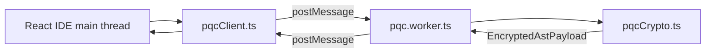

# Client-side PQC Web Worker

Post-quantum cryptography runs **off the main thread** in a dedicated Web Worker so ML-KEM and ML-DSA operations never freeze the React canvas. The implementation uses **`@noble/post-quantum`** (audited pure JavaScript). The same message contract supports swapping in **OQS-WASM** later without changing the wire format.

---

## Architecture



| File | Role |
|------|------|
| [`apps/web/src/crypto/pqcClient.ts`](../apps/web/src/crypto/pqcClient.ts) | Main-thread API: spawn worker, `generateKemKeypair`, `generateSignKeypair`, `encryptAndSignAst` |
| [`apps/web/src/workers/pqc.worker.ts`](../apps/web/src/workers/pqc.worker.ts) | Worker entry: routes `postMessage` requests |
| [`apps/web/src/workers/pqcCrypto.ts`](../apps/web/src/workers/pqcCrypto.ts) | **Exact crypto functions** (testable, used inside worker) |

---

## Core functions (deliverable)

These three operations satisfy the Phase 2.2 spec. They live in `pqcCrypto.ts` and execute inside the worker.

### 1) Generate ML-KEM keypair

```typescript
import { generateMlKemKeypair } from "./pqcCrypto";

const { publicKey, secretKey, publicKeyB64 } = generateMlKemKeypair();
// ML-KEM-768 via ml_kem768.keygen(seed); seed is secureZero'd after use
```

Main-thread wrapper:

```typescript
import { generateKemKeypair } from "../crypto/pqcClient";
const { publicKeyB64, secretKey } = await generateKemKeypair();
```

### 2) Encapsulate AES-256-GCM key (ML-KEM-768)

```typescript
import { encapsulateAes256GcmKey, secureZero } from "./pqcCrypto";

const { kemCiphertext, aesKey } = encapsulateAes256GcmKey(serverKemPublicKey);
// sharedSecret is zeroed inside encapsulate; caller must secureZero(aesKey) after AES-GCM
```

`kemCiphertext` is sent as `payload.kem.ciphertext` (base64). `aesKey` is 32 bytes derived from the ML-KEM shared secret.

### 3) Sign encrypted AST envelope (ML-DSA-65)

After AES-GCM produces `iv`, `ciphertext`, `tag`, build canonical sign fields and sign:

```typescript
import { signMlDsaPayload } from "./pqcCrypto";
import { canonicalSignBytes, PQC_ALGORITHMS, toBase64 } from "@pqc/shared";

const signFields = { projectId, nonce, timestamp, kem, cipher };
const sig = signMlDsaPayload(signerSecretKey, signFields);
// payload.signature = { algorithm: "ML-DSA-65", value: toBase64(sig) }
```

The full save pipeline (`encryptAndSignAstPayload`) chains encapsulate → AES-GCM → sign and **always** zeroes `aesKey` and plaintext in a `finally` block.

---

## Worker message protocol

| `type` | Input | Output |
|--------|-------|--------|
| `GENERATE_KEM_KEYPAIR` | — | `kemPublicKey` (b64), `kemSecretKey` |
| `GENERATE_SIGN_KEYPAIR` | — | `signPublicKey` (b64), `signSecretKey` |
| `ENCRYPT_AND_SIGN_AST` | `astJson`, `projectId`, `signerSecretKey`, `signerPublicKeyId`, `serverKemPublicKey` | `EncryptedAstPayload` |
| `ZERO_BUFFER` | `ArrayBuffer` | ok |

---

## Secure memory management

```typescript
export function secureZero(buf: Uint8Array): void {
  buf.fill(0);
  crypto.getRandomValues(buf); // overwrite before second zero
  buf.fill(0);
}
```

Applied to:

- KEM/DSA keygen seeds
- ML-KEM `sharedSecret` immediately after slicing `aesKey`
- AES-256 content key and AST plaintext after encrypt (in `finally`)
- Optional `ZERO_BUFFER` RPC from main thread via `zeroizeBuffer()`

---

## Save flow (IDE → gateway)

1. User clicks **Save** → `syncProject()` in [`projects.ts`](../apps/web/src/api/projects.ts).
2. `encryptAndSignAst()` posts `ENCRYPT_AND_SIGN_AST` to the worker.
3. Worker returns `EncryptedAstPayload` (no secrets).
4. `POST /api/projects/:id/sync` with Bearer JWT + JSON body.

Server KEM keys are created at `dev-register` on the gateway; the client only **encapsulates** to the server’s published ML-KEM public key.

---

## Testing

- Unit tests: [`apps/web/src/workers/pqcCrypto.test.ts`](../apps/web/src/workers/pqcCrypto.test.ts) (runs in Vitest, no worker spawn).
- RTL / layout: [`pqcClient.mock.ts`](../apps/web/src/test/mocks/pqcClient.mock.ts) stubs the main-thread client.
- E2E: [`ide-save-flow.spec.ts`](../apps/e2e/tests/ide-save-flow.spec.ts) asserts `ML-KEM-768` + `ML-DSA-65` on sync body.

---

## OQS-WASM upgrade path

Replace imports in `pqcCrypto.ts` with WASM bindings that expose the same three primitives. Keep `WorkerRequest` / `EncryptedAstPayload` unchanged. Vite already bundles workers as ES modules via `new URL(..., import.meta.url)`.
