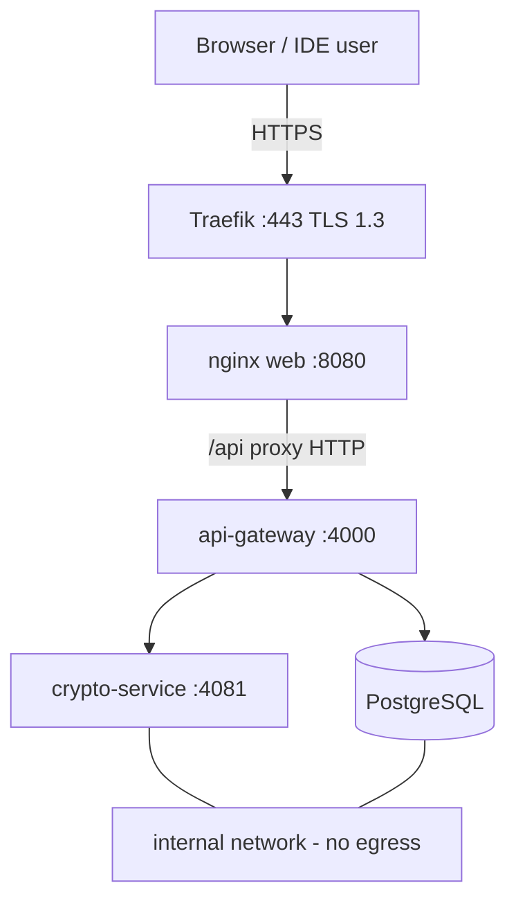

# Sovereign Container Deployment

Multi-stage Docker images, non-root runtimes, isolated internal network for PQC/crypto/DB, and **Traefik** terminating **TLS 1.3** at the edge (outer envelope around ML-KEM + AES-GCM sync payloads).

---

## Architecture



| Network | Services | Egress |
|---------|----------|--------|
| **edge** | Traefik, web | External clients → Traefik only |
| **internal** | api-gateway, crypto-service, postgres | `internal: true` — no internet |

---

## Dockerfiles (deliverable)

| Service | Base image | User | Path |
|---------|------------|------|------|
| **Web (frontend)** | `nginx:alpine` (after Node build) | `nginx` | [`apps/web/Dockerfile`](../apps/web/Dockerfile) |
| **API (backend)** | `node:20-alpine` (pnpm deploy) | `uid 10001` | [`apps/api-gateway/Dockerfile`](../apps/api-gateway/Dockerfile) |
| **Crypto** | `distroless/static-debian12:nonroot` | `nonroot` | [`apps/crypto-service/Dockerfile`](../apps/crypto-service/Dockerfile) |

All images use **multi-stage builds** to keep attack surface and size minimal. Build context is repo root (see [`.dockerignore`](../.dockerignore)).

---

## `docker-compose.yml`

Path: [`infra/docker-compose.yml`](../infra/docker-compose.yml)

| Service | Role |
|---------|------|
| `postgres` | Persistent AST metadata / users (`postgres_data` volume) |
| `crypto-service` | ML-KEM decapsulation (internal only) |
| `api-gateway` | Fastify API + sync (`read_only`, tmpfs) |
| `web` | Static IDE + reverse proxy to gateway |
| `traefik` | TLS 1.3 reverse proxy → `web` |

### Environment injection

Copy [`infra/.env.example`](../infra/.env.example) → `infra/.env`. Required:

- `POSTGRES_PASSWORD`
- `JWT_SECRET`
- `CRYPTO_SERVICE_SECRET`

Compose substitutes `${VAR}` and fails fast with `:?` on secrets.

### Volumes

| Volume | Mount |
|--------|--------|
| `postgres_data` | PostgreSQL data directory |
| `./traefik/dynamic` | TLS options + optional file routes |
| `./traefik/certs` | TLS certificate pair (sovereign PKI) |

---

## TLS 1.3 (Traefik)

[`infra/traefik/dynamic/tls-options.yml`](../infra/traefik/dynamic/tls-options.yml):

- `minVersion: VersionTLS13`
- `sniStrict: true`
- Modern AEAD cipher suites only

Traefik wraps HTTPS to nginx; **PQC** (ML-KEM / ML-DSA) remains in sync JSON bodies on `/api/*`.

Mount certificates at `infra/traefik/certs/` (`fullchain.pem`, `privkey.pem`). File provider loads [`tls-certs.yml`](../infra/traefik/dynamic/tls-certs.yml) as the default store.

**Local self-signed cert (dev only):**

```bash
openssl req -x509 -nodes -newkey rsa:2048 \
  -keyout infra/traefik/certs/privkey.pem \
  -out infra/traefik/certs/fullchain.pem \
  -days 365 -subj "/CN=localhost"
```

Or use [mkcert](https://github.com/FiloSottile/mkcert) for a locally-trusted cert. Then:

```bash
docker compose -f infra/docker-compose.yml --profile tls-edge up -d --build
```

Open `https://localhost` (accept the browser warning for self-signed).

---

## Commands

**Production-style (Traefik on 443):**

```bash
cp infra/.env.example infra/.env
# edit secrets
docker compose -f infra/docker-compose.yml up -d --build
```

**Local dev (direct ports 4000 / 4001, Traefik disabled):**

```bash
docker compose -f infra/docker-compose.yml -f infra/docker-compose.dev.yml up -d --build
```

| URL | Service |
|-----|---------|
| http://localhost:4001 | React IDE |
| http://localhost:4000/api/health | API gateway |
| https://localhost (or `PQC_DOMAIN`) | Via Traefik when certs configured |

---

## Security controls

- Non-root users in all app images
- `read_only: true` + `tmpfs` for writable temp paths
- `security_opt: no-new-privileges:true`
- Internal network isolates database and crypto service
- No plaintext project files in containers (browser worker + optional Tauri disk encryption)

---

## CI

GitHub Actions builds the stack: `.github/workflows/ci.yml` → `docker compose -f infra/docker-compose.yml build`.
