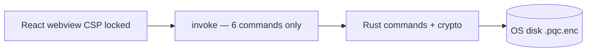

# Tauri Secure Desktop Wrapper

The desktop app (`apps/desktop`) wraps the React IDE in **Tauri 2** (Rust) instead of Electron for a smaller native attack surface. The webview cannot access the filesystem directly — only **explicit `#[tauri::command]` IPC** to encrypt or decrypt project files.

---

## Architecture



| Layer | Path |
|-------|------|
| Security config | [`tauri.conf.json`](../apps/desktop/src-tauri/tauri.conf.json) |
| Capability ACL | [`capabilities/default.json`](../apps/desktop/src-tauri/capabilities/default.json) |
| Permission set | [`permissions/encrypted-storage.toml`](../apps/desktop/src-tauri/permissions/encrypted-storage.toml) |
| Commands | [`src/commands.rs`](../apps/desktop/src-tauri/src/commands.rs) |
| AES-256-GCM | [`src/crypto.rs`](../apps/desktop/src-tauri/src/crypto.rs) |
| Path sandbox | [`src/paths.rs`](../apps/desktop/src-tauri/src/paths.rs) |
| Frontend IPC | [`apps/web/src/desktop/tauriStorage.ts`](../apps/web/src/desktop/tauriStorage.ts) |

---

## `tauri.conf.json` security

- **CSP** — `default-src 'self'`; `connect-src` limited to API gateway (`:4000`); `object-src 'none'`; `frame-ancestors 'none'`
- **devCsp** — separate relaxed policy for Vite HMR on `:4001`
- **freezePrototype** — `true` (mitigate prototype pollution)
- **dangerousDisableAssetCspModification** — `false`
- **capabilities** — only `encrypted-storage-capability` (no broad fs/shell plugins)
- **Removed** `tauri-plugin-opener` — reduces IPC surface

---

## IPC commands (deliverable)

| Command | Purpose |
|---------|---------|
| `write_encrypted_project` | AES-256-GCM encrypt AST JSON → `{app_data}/projects/{id}.pqc.enc` |
| `read_encrypted_project` | Decrypt file → plaintext JSON string |
| `list_encrypted_projects` | List project ids with local encrypted files |
| `delete_encrypted_project` | Delete encrypted file |
| `get_projects_storage_path` | Return storage directory (no secrets) |
| `hardware_key_available` | Host has `PQC_HSM_ENABLED` + `PQC_HSM_KEY_B64` |

**Path safety:** `project_id` must be alphanumeric + hyphen (UUID). Arbitrary file paths from the UI are rejected.

---

## On-disk format

```json
{
  "version": 1,
  "kdf": "argon2id",
  "salt": "<base64 16 bytes>",
  "nonce": "<base64 12 bytes>",
  "ciphertext": "<base64 AES-GCM>",
  "key_source": "passphrase"
}
```

- **KDF:** Argon2id (passphrase → 32-byte key)
- **Cipher:** AES-256-GCM
- **Key zeroization:** `zeroize` crate clears derived keys after each operation

---

## Passphrase vs hardware key

**Passphrase (default):** User supplies passphrase per read/write; never logged or persisted by Rust.

**Hardware (stub / env):**

```bash
PQC_HSM_ENABLED=1
PQC_HSM_KEY_B64=<base64-encoded-32-byte-key>
```

Call with `useHardwareKey: true` from the frontend. Replace env-based key loading with PKCS#11 / TPM in production.

---

## Frontend usage

```typescript
import {
  writeEncryptedProject,
  readEncryptedProject,
  isTauriDesktop,
} from "./desktop/tauriStorage";

if (isTauriDesktop()) {
  await writeEncryptedProject(projectId, JSON.stringify(ast), passphrase);
}
```

Install Tauri API in web when building for desktop: `@tauri-apps/api` (optional devDependency).

---

## Build

```bash
pnpm --filter @pqc/web build
cd apps/desktop
pnpm tauri build
```

Requires Rust toolchain. See also [`docs/deploy-tauri.md`](deploy-tauri.md).

---

## Tests

```bash
cd apps/desktop/src-tauri
cargo test
```

Rust unit tests in `crypto.rs` cover encrypt/decrypt roundtrip and wrong passphrase failure.
