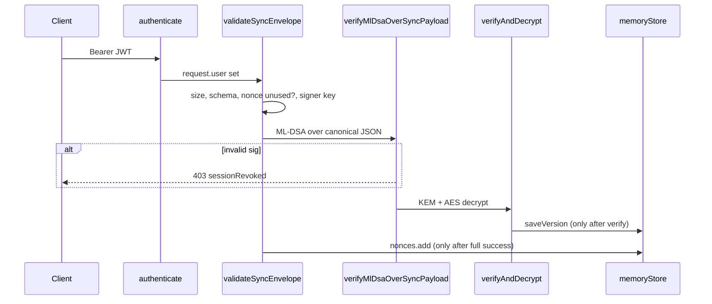

# Zero-Trust Authentication and ML-DSA Verification

JWTs identify **who** is calling; they do **not** authorize state changes. Every **Save** (`sync`) and **Publish** request must carry a unique cryptographic **nonce** and an **ML-DSA-65** signature verified against the user’s registered public key **before** any project data is written.

---

## Trust model

| Layer | Proves | Insufficient alone? |
|-------|--------|---------------------|
| **Bearer JWT** | Session / user id | Yes — can be stolen or replayed at HTTP layer |
| **Nonce + timestamp** | Fresh, one-time intent | Yes — without signature, attacker can forge body |
| **ML-DSA-65 signature** | Holder of signing secret key | **Required** for Save/Publish |

On signature verification failure the gateway **immediately revokes** the JWT (`revokedTokens` ledger), returns `sessionRevoked: true`, sets `X-Session-Revoked: true`, and writes a **HIGH** priority security audit entry.

---

## Middleware stack



| File | Role |
|------|------|
| [`middleware/auth.ts`](../apps/api-gateway/src/middleware/auth.ts) | JWT verify + revocation check |
| [`middleware/zero-trust.ts`](../apps/api-gateway/src/middleware/zero-trust.ts) | `failZeroTrustAuth`, `issueSessionToken` |
| [`middleware/sync-crypto.ts`](../apps/api-gateway/src/middleware/sync-crypto.ts) | Save: envelope + crypto pipeline |
| [`middleware/publish-zero-trust.ts`](../apps/api-gateway/src/middleware/publish-zero-trust.ts) | Publish: signed intent + ML-DSA |
| [`lib/mldsa-verify.ts`](../apps/api-gateway/src/lib/mldsa-verify.ts) | **ML-DSA verification primitives** |
| [`lib/sync-guard.ts`](../apps/api-gateway/src/lib/sync-guard.ts) | Nonce, timestamp, PQC-only guards |

---

## ML-DSA signature over Save (sync) body

The signed message is **not** the raw HTTP body. It is canonical JSON of:

```json
{
  "cipher": { "algorithm": "AES-256-GCM", "iv": "...", "ciphertext": "...", "tag": "..." },
  "kem": { "algorithm": "ML-KEM-768", "ciphertext": "..." },
  "nonce": "<uuid>",
  "projectId": "<uuid>",
  "timestamp": "<ISO-8601>"
}
```

Implementation: [`canonicalSignBytes`](../packages/shared/src/crypto-payload.ts) → UTF-8 → `ml_dsa65.verify(publicKey, signBytes, signature)`.

```typescript
// apps/api-gateway/src/lib/mldsa-verify.ts
export function verifyMlDsaOverSyncPayload(
  payload: EncryptedAstPayload,
  signerPublicKeyB64: string
): void {
  const signBytes = canonicalSignBytes({ projectId, nonce, timestamp, kem, cipher });
  if (!ml_dsa65.verify(pk, signBytes, sig)) throw new CryptoServiceError(403);
}
```

**Order of operations (mandatory):**

1. JWT `authenticate`
2. Parse + replay guards (nonce must **not** already exist in ledger)
3. Resolve `signerPublicKeyId` → registered `publicKeyB64`
4. **`verifyMlDsaOverSyncPayload`** — fails → `failZeroTrustAuth` (no DB write)
5. ML-KEM decapsulate + AES-GCM decrypt
6. **`memoryStore.nonces.add`** and **`saveVersion`** — only after step 5 succeeds

---

## ML-DSA signature over Publish intent

Publish uses a lighter envelope ([`stateMutatingIntentSchema`](../packages/shared/src/crypto-payload.ts)):

```json
{
  "action": "publish",
  "nonce": "<uuid>",
  "projectId": "<uuid>",
  "timestamp": "<ISO-8601>",
  "signature": { "algorithm": "ML-DSA-65", "value": "<base64>" },
  "signerPublicKeyId": "<uuid>"
}
```

Canonical sign input: [`canonicalIntentSignBytes`](../packages/shared/src/crypto-payload.ts). Verified by `verifyMlDsaOverIntent` in [`publish-zero-trust.ts`](../apps/api-gateway/src/middleware/publish-zero-trust.ts).

---

## Session revocation (`failZeroTrustAuth`)

```typescript
export async function failZeroTrustAuth(reply, { token, userId, event, detail }) {
  revokeToken(token);
  await memoryStore.logSecurity(userId, event, detail, "HIGH");
  reply.header("X-Session-Revoked", "true");
  return reply.code(403).send({ message: "Forbidden", sessionRevoked: true });
}
```

Client must call `/api/auth/dev-register` (or login) again to obtain a new JWT.

---

## Security audit log

[`memoryStore.logSecurity`](../apps/api-gateway/src/db/memory-store.ts) records:

| Priority | Events |
|----------|--------|
| **HIGH** | `SIGNATURE_VERIFICATION_FAILED`, `CLASSICAL_ALGORITHM_REJECTED`, `UNKNOWN_SIGNER_KEY` |
| **NORMAL** | Other policy events |

HIGH entries are prefixed `[SECURITY:HIGH]` on stderr for SIEM ingestion.

---

## Replay prevention

- **`nonce`**: UUID per Save/Publish; stored as `userId:nonce` after successful verify only.
- **`timestamp`**: Must be within `NONCE_TTL_MS` (default 5 minutes) of server clock.
- Reused nonce → **409** `Nonce already used` (token **not** revoked — likely client retry bug).

---

## Tests

- [`mldsa-verify.test.ts`](../apps/api-gateway/src/lib/mldsa-verify.test.ts) — valid / tampered signatures
- [`projects.sync.test.ts`](../apps/api-gateway/src/routes/projects.sync.test.ts) — `sessionRevoked` on crypto failure
- [`projects.publish.test.ts`](../apps/api-gateway/src/routes/projects.publish.test.ts) — publish intent + revocation

Run: `pnpm --filter @pqc/api-gateway test`
